# glowcost-geiger

**A four-wire, Raspberry Pi-controlled Geiger module:** 3.3 V in, ground, a
3.3 V pulse output and power enable. Uses the same **CTC-5 / STS-5 (СТС-5)**
Geiger–Müller tube as geiger2, biased near 400 V.

**Status: functional tscircuit schematic, reproducible SPICE study and basic unrouted placement.** The HV
oscillator/switch, comparator timing and output blanking contain behavioral
models. JLC component candidates are documented; this is not a routed PCB,
complete pin-level production schematic or fabrication release. HV protection
is modeled, not bench-qualified.

## Contents

- [Pi interface](#raspberry-pi-interface) and [schematic](#circuit)
- [PCB renders and layers](#pcb-renders-and-layer-views)
- [HV protection](#tube-and-hv-protection)
- [Performance summary](#expected-dead-time-rate-and-current)
- [Parts summary](#selected-parts) and [cost summary](#expected-cost)
- [Design decisions and references](#design-details)
- [Exact parts and rating checks](#part-details)
- [Dead time, dose conversion and current calculations](#performance-details)
- [Detailed five-, 25- and 50-board costs](#cost-details)
- [Layout dimensions, assembly and validation](#layout-details)
- [Reproduce the outputs](#reproduce)

All project documentation is consolidated here. The `docs/` directory holds
rendered images, simulation results and machine-readable review data.

## Raspberry Pi interface

| J1 pin | Signal | Direction at module | Connection / behavior |
|---|---|---|---|
| 1 | 3V3 | Power input | Pi **3.3 V power rail**, nominal 3.3 V; simulated ±5% |
| 2 | GND | Return | Common ground with Pi |
| 3 | PULSE | Output | Active-high **3.3 V** logic; count rising edges |
| 4 | EN | Input | Active-high 3.3 V control; 100 kΩ pulldown defaults off |

The initial 5 V requirement was superseded by 3.3 V for Raspberry Pi operation.
PULSE is TTL-compatible in level, but is **not a 5 V output**. Power the module
from the Pi's power rail, not from a GPIO. EN gates HV switching and blanks the
pulse output; low-voltage circuitry may still consume current while disabled.

Example for a Pi with a 40-pin header: physical pin 1 → 3V3, pin 6 → GND,
pin 11 / BCM GPIO17 → EN, pin 13 / BCM GPIO27 ← PULSE. These GPIO assignments
are examples, not fixed by the hardware. Keep EN low during initialization;
allow the HV rail to settle after asserting it. No HV-ready pin is exposed.
Use edge counting; Linux polling can miss short pulses. The simulated pulse
width is stimulus-dependent and is not a measured tube specification.

No MCU, radio, firmware, battery or display. Tube contacts are internal to the
module. The tube will mount on-board with clips. J1 is a locking SMT JST GH candidate
from JLC; 0603 low-voltage passives are accepted. Target batch: 25–50 boards,
indoor use, beta sensitivity retained. Tube clips are Littelfuse 10207101009 / C142864, **J2/J3 DNP at JLC**; cable length remains open.

## Circuit

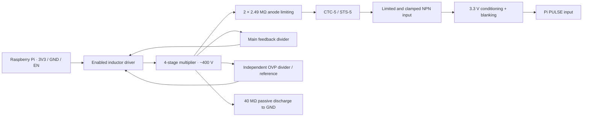

### Annotated schematic

[Full annotated sheet](docs/schematic.svg) · [tscircuit source](board/module.circuit.tsx)
· [SPICE source](sim/hv/converter.cir) · [JLC candidates and design decisions](#design-details)

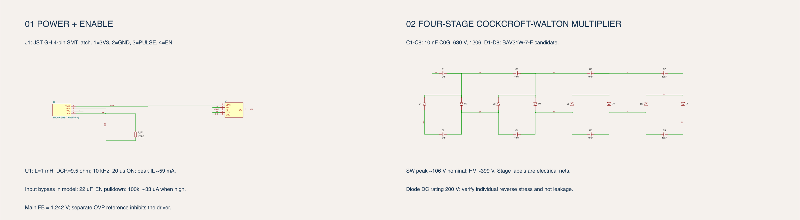

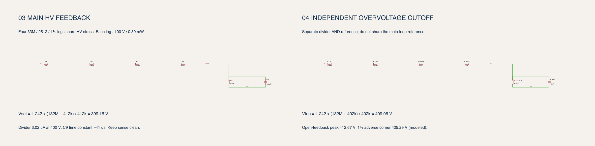

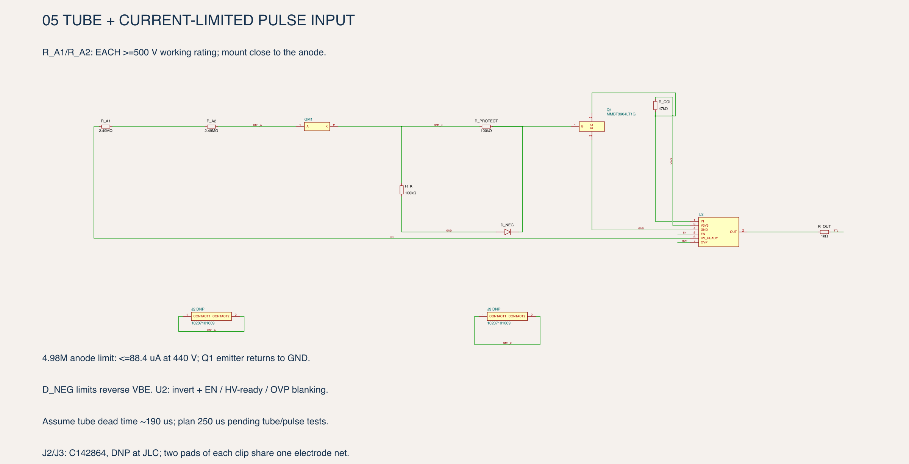

[Passive discharge detail](docs/schematic-discharge.svg)

The sheet is organized into six annotated sections: power/enable, multiplier,
main feedback, independent overvoltage cutoff, tube/pulse input and discharge.
Named nets connect the sections without wires crossing the notes. Open the SVG
to zoom into component values and pin labels. The drawing shows all eight
multiplier diodes/capacitors, feedback and protection dividers, bleeder and tube interface. U1/U2 are explicitly labeled behavioral
blocks. Their symbols are not real IC pinouts. The checker compares 47 components
and 30 exposed nets against SPICE, including diode polarity and passive values.

## PCB renders and layer views

The **140 × 60 mm, two-layer placement study** holds 44 footprints, with all SMT
parts on top. J2/J3 retain their holes and pads while remaining **C142864 DNP**.
The controller area is reserved for the physical implementation of U1/U2.
There are **no routed traces, vias or copper planes** yet.

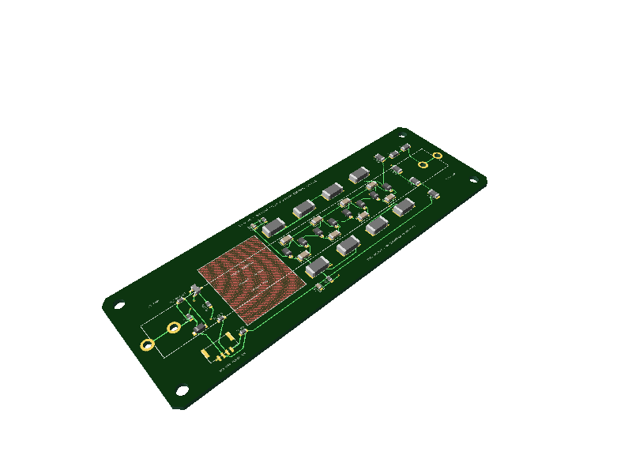

This preview uses generic package models; the tube and accurate connector/clip
bodies are absent. Red hatching marks the tube keepout, not copper.

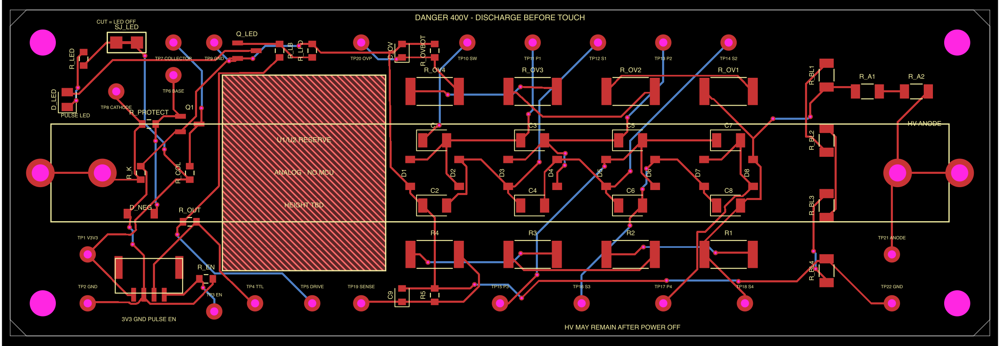

| Top copper pads | Bottom copper annuli |
|---|---|
| 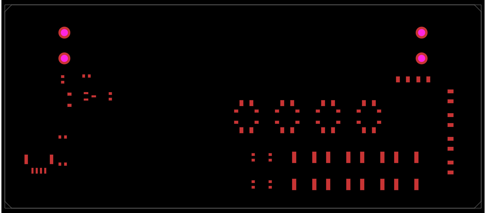 | 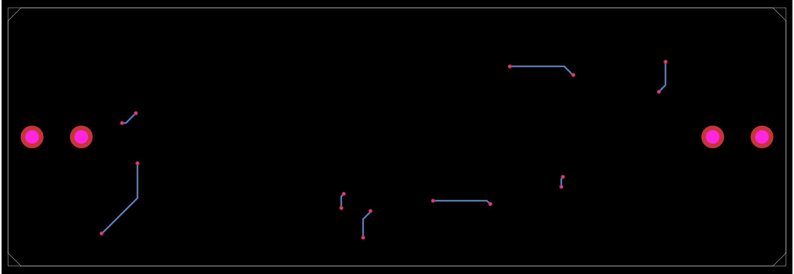 |
| Top silkscreen | Drill locations |
| 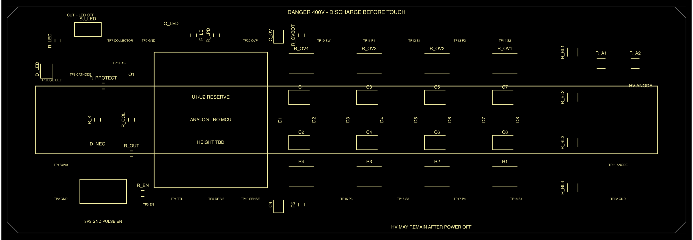 | 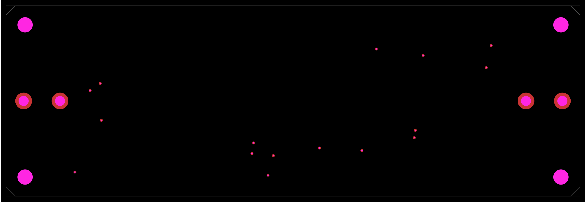 |

These are design-layer views, not manufacturing Gerbers. Bottom copper currently
contains only the clip-hole annuli. The drill view includes annuli for context.

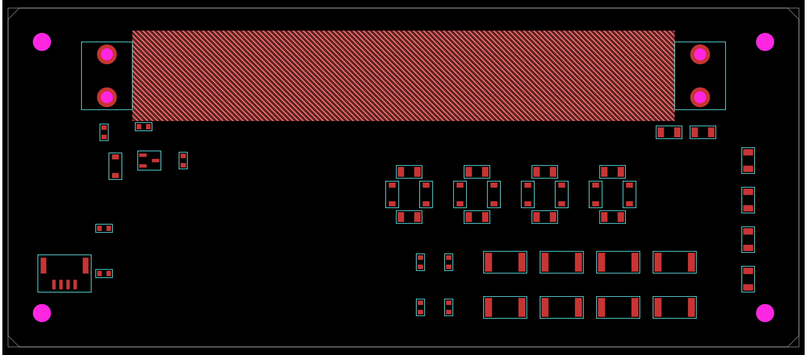

[Layout dimensions, assembly notes and remaining checks](#layout-details) ·
[Placement checks](docs/layout/checks.json) ·
[Review coordinates](docs/layout/placement.csv) ·
[Published circuit JSON](docs/layout/circuit.json) ·
[Layout source](board/layout.circuit.tsx)

Courtyard and mechanical-reserve checks pass. HV creepage/clearance, routing,
actual tube fit and enclosure interference still require review. The larger board
supersedes the earlier 125 × 35 mm cost assumption; obtain a fresh PCB quote.

## Tube and HV protection

Inherited geiger2 tube targets: CTC-5 / STS-5, approximately 110 × Ø12 mm,
360–440 V operating range, 5–10 MΩ anode load. These are project requirements
for a NOS tube; confirm the actual tube's plateau and pulse charge on the bench.

- **Independent overvoltage cutoff:** separate divider and reference, nominal
  ~409 V trip, inhibits switching if the main regulation loop fails low.
- **Passive discharge:** four 10 MΩ resistors remain connected with EN off.
- **Fault-current limitation:** two 2.49 MΩ anode resistors; specify each for
  ≥500 V working voltage so one shorted resistor does not overstress the other.
- **Pi input separation:** grounded-emitter NPN with 100 kΩ base resistance,
  reverse base-emitter clamp, local 3.3 V collector pullup and 1 kΩ output series
  resistor. HV is not intentionally connected to the GPIO.
- **Startup/shutdown blanking:** pulses are suppressed when disabled, below
  360 V or in overvoltage. Physical logic implementation remains to be designed.

**EN off does not mean discharged.** The plots show residual HV after shutdown.
The board must enclose exposed HV and maintain HV-to-logic creepage/clearance;
those protections require an actual PCB/enclosure review. This common-ground
architecture is not galvanic isolation. See [fault coverage and unresolved
protection checks](#design-details-hv-protection-and-limits).

## Expected dead time, rate and current

| Quantity | Planning estimate |
|---|---|
| Effective dead time | **~190–250 µs**; use **250 µs** until measured |
| 5% uncorrected dead-time-loss boundary | **200 observed cps**; ~**1.21 µSv/min** conditional gamma estimate |
| 10% uncorrected loss boundary | **400 observed cps**; ~**2.55 µSv/min** conditional gamma estimate |
| Existing 3.3 V power-path simulation | **2.515 mA** at 1 µA added HV load |
| Illustrative whole-module operating budget | **~5.1 mA**; reserve **10 mA continuous** |
| Startup after enable | **5.77 mA modeled average**; reserve **20 mA average**, separate from inrush |

**Counts are primary; µSv is approximate.** The rate conversions assume a
reference gamma response of 2.9 cps per µSv/h, not calibration of this tube.
They are not valid for arbitrary beta/gamma mixtures. The mathematical 4000 cps
ceiling (~23 µSv/min naive display) is **not a usable measurement range**.

The 33 new paired-pulse SPICE cases resolve synthetic pulses at 150–175 µs
spacing, but do not model intrinsic tube dead time. Power-on inrush is still
uncontrolled: the ideal 22 µF / 0.5 Ω input model produces a 6.6 A mathematical
spike, so physical soft-start and Pi rail-droop tests remain necessary.

[Detailed calculations, source references, pulse-pair charts and current budget](#performance-details)
· [Machine-readable results](docs/performance/results.json)

## Selected parts

J2/J3 use **Littelfuse 10207101009 / C142864**, marked **DNP** for JLC assembly.
The remaining drawn passives now carry exact part numbers. The 33 MΩ dividers
use stocked 2512 parts; the sensing bottoms use 0.1% thin-film 0603 parts.
The 2.49 MΩ anode resistors use a Vishay HV part requiring external sourcing.
[Selections and rating checks](#part-details) ·
[Generated review inventory, including DNP](docs/review-bom.csv).

Physical controller parts are selected separately; U1/U2 remain behavioral.
The selected slew-control switch is not yet implemented in the simulated circuit.

## Expected cost

**Five-board prototype batch, tubes already owned:** allow **$150–250** for
assembled electronics with a provisional allowance for externally sourced HV
resistors, or **$185–335** including clips/cables and shipping. Taxes, enclosure and test labor are extra. See the
[five-board breakdown and unresolved parts](#cost-details-five-board-prototype-batch--tubes-already-owned).

Earlier planning baseline, before the external HV-resistor selection:
**$14–19 per assembled electronics board at 25 units** ($350–475 total),
or **$12–16 at 50 units** ($600–800 total), in USD. These estimates include PCB,
SMT assembly and allowances for the unfinished physical circuitry. They exclude
the tube, clips/cable, enclosure, shipping, tax and functional testing.

The catalog-priced candidate parts alone total $8.41 / $7.74 per board; the two
comparator/reference ICs and eight HV capacitors dominate.
[Detailed cost breakdown, sources and assumptions](#cost-details).

## Assembly plan

- **25–50 boards:** optimize JLC SMT assembly cost; use 0603 low-voltage passives
  and larger parts where HV ratings require them.
- **Pi connector:** locking SMT JST GH, BM04B-GHS-TBT(LF)(SN), JLC C161692.
  The mating cable is separate; its length remains to be specified.
- **Tube:** on-board clips; install the NOS tube after reflow and cleaning.
  J2/J3 use C142864, DNP at JLC; fit and mechanical retention still need checking.
- **Environment:** dry indoor enclosure initially. Future conformal coating or
  potting requires rechecking HV leakage, pulse recovery and beta response.
  Keep coating out of connector and tube-clip contact surfaces.

[Candidate stock snapshot](docs/assembly-stock.json) and
[assembly decisions](#design-details) record the selections and open checks.

## SPICE results

All charts below are generated from this repository's **3.3 V model**, not copied
from the older battery-powered geiger2 results.

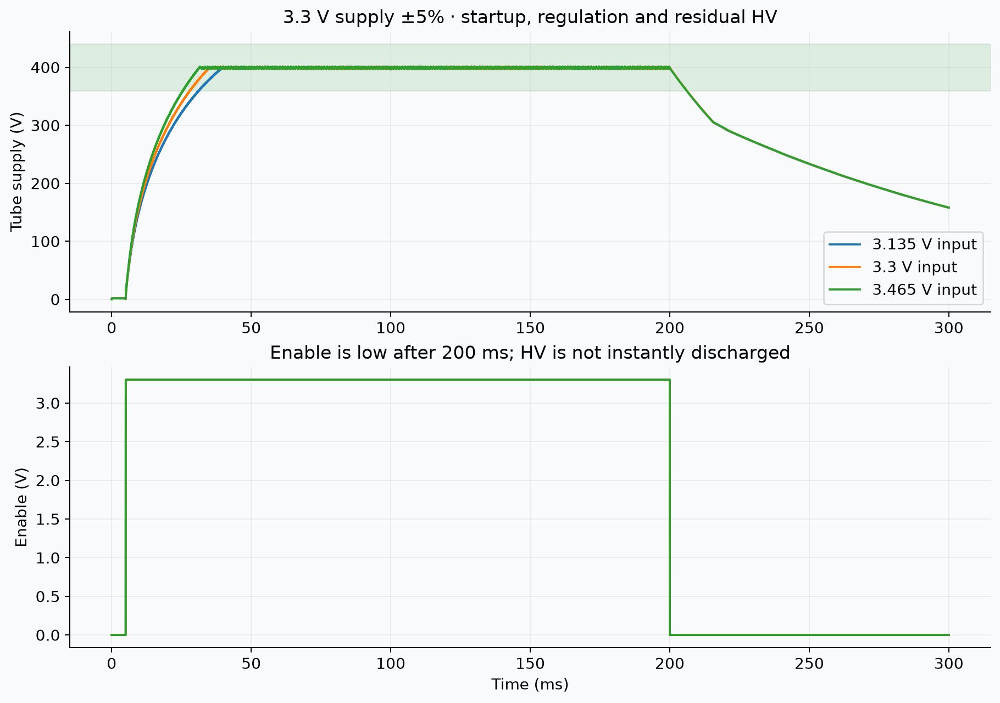

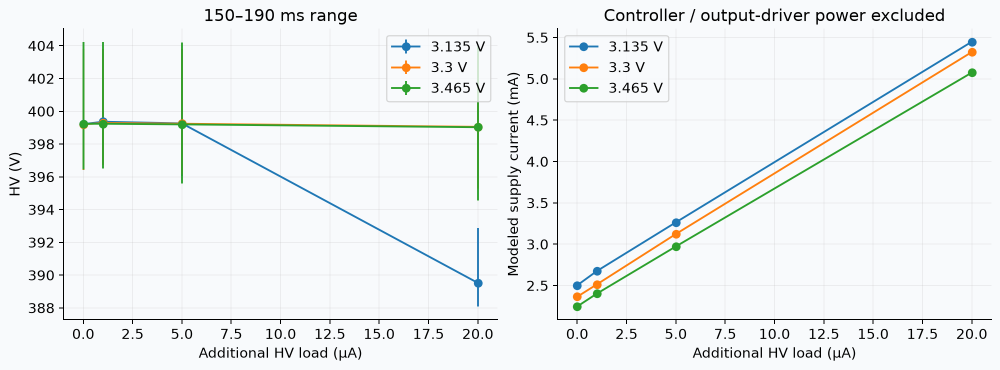

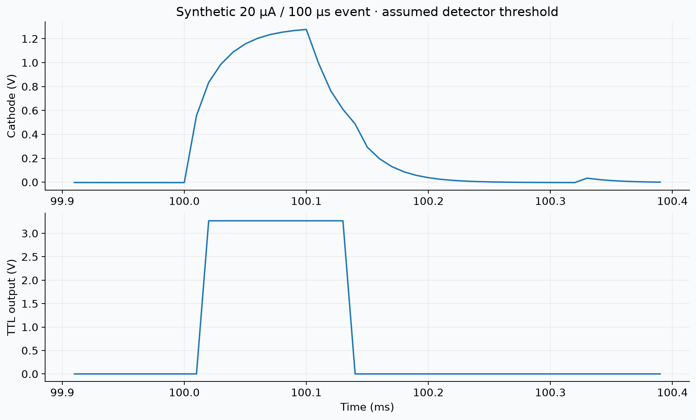

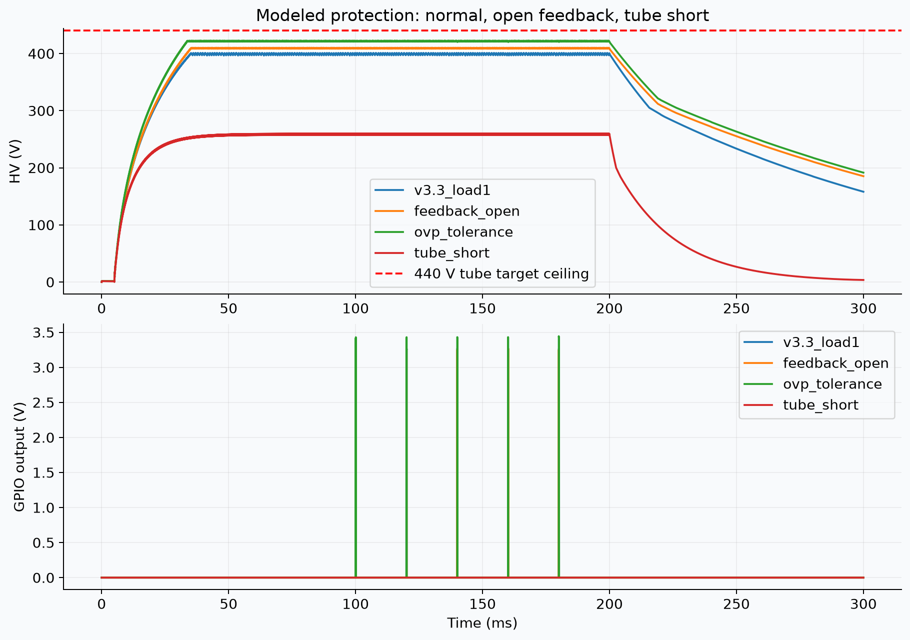

<!-- RESULTS START -->
| Supply / 1 µA added load | Mean HV | HV range | First 396 V after EN | Modeled input |
|---|---:|---:|---:|---:|
| 3.135 V | 399.36 V | 396.81–403.49 V | 33.22 ms | 2.676 mA |
| 3.3 V | 399.28 V | 396.73–403.79 V | 28.72 ms | 2.515 mA |
| 3.465 V | 399.24 V | 396.50–404.23 V | 25.32 ms | 2.403 mA |

Native: 16 cases. Open-feedback peak: **412.67 V**;
worst-direction 1% OVP reference/divider corner peak: **425.29 V**.
Nominal HV remains **158.1 V at 300 ms**, about 100 ms after EN falls.
WASM: 682,075 points over 120 ms; mean HV **399.29 V**.
<!-- RESULTS END -->

[Native metrics JSON](docs/hv/results.json) · [CSV](docs/hv/results.csv)
· [tscircuit/WASM metrics](docs/hv/tsci-results.json)

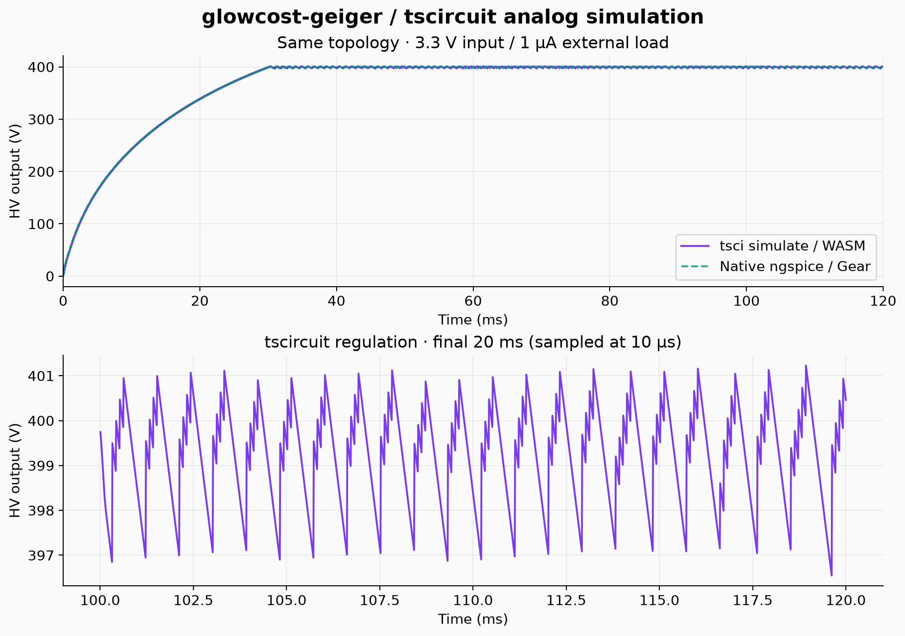

### Assumptions and practical limits

- 1 mH linear inductor, 9.5 Ω DCR; 10 kHz, 20 µs switch pulses. Ideal 2 Ω
  controlled switch with 30 pF output capacitance. Actual transistor base/gate
  drive, saturation, core loss and controller current are not modeled.
- Eight 10 nF capacitors, generic fast diodes. The generic diode's 250 V model
  breakdown is **not** the candidate BAV21W's 200 V DC rating. Per-device reverse
  stress, leakage and temperature must be checked before locking that part.
- Main divider: 4×33 MΩ + 412 kΩ, 1.242 V reference → 399.16 V nominal.
  OVP: independent 4×33 MΩ + 402 kΩ → 409.06 V nominal. OVP is behavioral;
  real delay, power sequencing and shared-cause failures remain unverified.
- At 400 V: main divider ~3.02 µA, OVP divider ~3.02 µA, bleeder 10 µA.
  Protection adds real input-power demand; do not quote the old battery results.
- Synthetic tube event: 20 µA for 100 µs every 20 ms, starting at 100 ms,
  scaled down with HV; 5 pF tube capacitance is assumed. This is neither a
  physical avalanche model nor a calibration/count-rate/dead-time prediction.
- Reported input current includes the modeled converter and passive loads,
  but excludes real oscillator/comparator/logic/driver current. It is not a
  complete module current budget or a measured efficiency claim.
- Native ngspice uses Gear integration. WASM uses the tscircuit engine defaults.
  Native EN rises at 5 ms; WASM EN is high at t=0. The comparison aligns this
  5 ms difference. Numerical switching ripple is not hardware verification.
- The WASM model reports a **3.50 V numerical pulse-transition peak** at a
  nominal 3.3 V supply; native reports ~3.30 V. Resolve time-step/driver-model
  convergence and verify GPIO transients on hardware before connecting a Pi.
  A behavioral simulation is not proof of a protected physical output.
- Native metrics use adaptive samples over 150–190 ms; plotted traces are
  linearized at 10 µs and can miss narrow peaks. WASM metrics use 80–120 ms.
  Startup is first crossing of 396 V, not a guaranteed settling time. The
  3.135 V / 20 µA stress case does not reach 396 V in the enabled interval;
  the study does not establish 20 µA load capability at the low supply corner.

<a id="design-details"></a>

## Design decisions and part candidates

This is a tscircuit **functional design and SPICE study**, not an assembly release.
JLC parts are preferred. Parts below are candidates, and U1/U2 in the schematic
are behavioral blocks, not orderable ICs. Pin-level controller implementation,
qualified protection components, PCB routing, ERC/DRC and bench verification remain.

<a id="design-details-latest-part-decisions"></a>

### Latest part decisions

See [exact part selections](#part-details) for the current exact selections.
J2/J3 are C142864, DNP at JLC. Drawn passives now have MPNs; controller parts
are selected for implementation. Earlier open-part notes below are superseded
by the exact selections in this README. External anode-resistor procurement and physical validation
remain open.

<a id="design-details-requirements"></a>

### Requirements

- Supply: **3.3 V**, replacing the initial 5 V request; test supply ±5%.
- Host: Raspberry Pi; 3.3 V pulse output and active-high 3.3 V enable.
- Exactly four external connections: 3V3, GND, PULSE, EN.
- Same CTC-5 / STS-5 (СТС-5) tube as geiger2; ~400 V bias.
- No MCU, firmware, radio, battery, display or external HV/sense connector.
- Connector: locking 4-pin SMT from JLC; JST GH BM04B-GHS-TBT(LF)(SN) candidate.
- Tube: user already owns the tubes; mounted on-board with clips; C142864 selected, DNP at JLC; mounting geometry still needs verification.
- Use: indoor background monitoring, beta retained; raw counts primary, µSv approximate.
- Assembly: 25–50 boards, optimize JLC cost; future coating/potting requires requalification.
- Accepted passives: 0603 low voltage; choose larger HV packages for ratings and stock.
- EN has 100 kΩ pulldown. EN stops switching and blanks pulses; it is not
  galvanic isolation, instant HV discharge, or a zero-current power disconnect.

<a id="design-details-jlc-catalog-review--2026-09-15"></a>

### JLC catalog review · 2026-09-15

Inventory is a database snapshot, not a reservation. Prefer Basic/Preferred when
an exact part meets ratings; do not substitute similarly named manufacturers.
Parts are not locked until their datasheets and footprints are qualified.

| Function | Candidate MPN | LCSC | Package | Decision |
|---|---|---|---|---|
| CW capacitors, 8×10 nF | TDK C3216C0G2J103JT000N | C342714 | 1206 | C0G, 630 V, ±5%; avoids X7R bias loss |
| CW diodes | Diodes Inc. BAV21W-7-F | C155214 | SOD-123 | 200 V DC catalog rating; verify reverse stress and hot leakage |
| Inductor | TDK B82442T1105K050 | C2041861 | 5.6×5 mm | 1 mH, 9.5 Ω DCR, 150 mA rated, 310 mA catalog saturation; confirmation requested |
| Regulation and separate OVP reference | TI TLV3012BIDBVR | C20345924 | SOT-23-6 | Two separate comparator/reference channels; behavioral models presently |
| Oscillator | TI LMC555CMX/NOPB | C90760 | SOIC-8 | Candidate; actual 10 kHz / 20 µs pulse circuit not implemented |
| HV switch | onsemi MMBTA42LT1G | C94389 | SOT-23 | Candidate; base drive, SOA and switching loss not implemented in ideal switch model |
| Pulse transistor | onsemi MMBT3904LT1G | C81464 | SOT-23 | Generic NPN model presently; current-limited base and grounded emitter |
| 3.3 V pulse conditioning | TI SN74LVC1G14DBVR | C7835 | SOT-23-5 | Candidate only; extra blanking logic required |
| Passive bleeder, 4×10 MΩ | UNI-ROYAL 1206W4F1005T5E | C26119 | 1206 | Catalog 200 V / 0.25 W / 1%; 23,028 stock; replaces 27-stock Yageo candidate |
| Locking SMT connector | JST BM04B-GHS-TBT(LF)(SN) | C161692 | 1.25 mm pitch | 36,168 catalog stock; mating GHR-04V-S housing; verify pin-1 orientation in final footprint |
| Divider, anode resistors, protection diode, tube clips | See current selections | — | — | Resolved MPNs in [part selection](#part-details); anode sourcing remains open |

The previously searched **SN74HCT14 is rejected for this 3.3 V design**: its
recommended supply starts at 4.5 V. The JLC search also confused MΩ with mΩ;
those milliohm results are rejected. The returned 33 MΩ 5% resistor is not locked
for a precision OVP divider. See [original search records](docs/parts-snapshot.json)
and [3.3 V searches](docs/parts-3v3-snapshot.json).

<a id="design-details-hv-protection-and-limits"></a>

### HV protection and limits

1. **Independent OVP channel:** separate 4×33 MΩ / 402 kΩ divider and reference
   inhibit switching above nominal 409.06 V. A 10 pF sense capacitor gives about
   4.01 µs time constant. This is a nominal behavioral protection study: reference
   accuracy, resistor tolerances, comparator delay and switching energy can raise
   the trip peak. A worst-direction 1% reference / 1% divider corner is simulated;
   temperature, leakage and real comparator delay still need qualification. The same reference must not be shared with the main loop.
2. **Passive discharge:** 4×10 MΩ from HV to ground, independent of enable or
   logic supply. Each leg sees ~100 V, 1 mW at 400 V. Total bleeder draw is 10 µA,
   4 mW. Neither disabling EN nor removing power proves the capacitors discharged.
3. **Tube current limiting:** 2×2.49 MΩ series anode resistors. At 440 V a
   tube short is limited to at most ~88.4 µA before cathode resistance. With one
   resistor shorted, the surviving resistor could see almost all HV: each anode
   resistor must therefore be rated for at least 500 V working voltage and the
   appropriate pulse load. A generic 1206 200 V part is insufficient here.
4. **Pi pulse protection:** 100 kΩ cathode return, 100 kΩ base resistor, grounded
   NPN emitter and reverse base-emitter clamp. There is no intentional HV-to-GPIO
   path. Collector is pulled up to local 3.3 V through 47 kΩ; output has 1 kΩ
   series resistance and a modeled 100 kΩ / 50 pF receiver. This shares ground;
   it is not galvanically isolated. Protect against unpowered-host backfeed in
   the physical logic implementation.
5. **Layout/enclosure:** keep HV and tube terminals physically away from J1 and
   Pi wiring, and cover exposed HV. Establish HV creepage and clearance from
   environment, material and applicable requirements before routing. Ordinary
   JLC minimum trace clearance is not an HV spacing rule. Schematic symbols
   and candidate packages do not constitute a creepage/clearance check.

The modeled faults are open main feedback, tube short and disabled startup.
Unmodeled faults include an OVP-divider open, switch short, clamp failure,
contamination/flashover, anode resistor failure, and external HV injection.
This repository does **not** certify Pi protection or touch safety.

<a id="design-details-primary-references"></a>

### Primary references

- [ADI CN0536](https://www.analog.com/en/resources/reference-designs/circuits-from-the-lab/cn0536.html): multiplier and tube detection reference.
- [TI TLV3012B](https://www.ti.com/lit/ds/symlink/tlv3012.pdf): supply, reference accuracy and comparator behavior.
- [TI SN74LVC1G14](https://www.ti.com/lit/ds/symlink/sn74lvc1g14.pdf): 3.3 V Schmitt logic candidate.
- [TDK B82442T](https://www.tdk-electronics.tdk.com/inf/30/db/ind_2008/b82442t.pdf): inductor family.
- [onsemi MMBT3904](https://www.onsemi.com/pdf/datasheet/mmbt3904lt1-d.pdf): pulse transistor.
- [Raspberry Pi GPIO guidance](https://pip-assets.raspberrypi.com/categories/685-whitepapers-app-notes-compliance-guides/documents/RP-006553-WP/A-history-of-GPIO-usage-on-Raspberry-Pi-devices-and-current-best-practices): 3.3 V interfaces.

Decision workflow: the user's `~/agent-skills/kicad-bom/SKILL.md` is used for
JLC lookup, packages, rating/derating and exact-part review. Circuit authoring
remains tscircuit as requested; no KiCad project or manufacturing BOM is implied.

<a id="design-details-assembly-and-enclosure-decisions"></a>

### Assembly and enclosure decisions

[JLC stock snapshot](docs/assembly-stock.json) records the latest exact-MPN searches.
The TDK C0G capacitor stock of 2,413 supports 400 placements for 50 boards with
margin. Keep its 630 V C0G rating; do not trade for high-stock X7R without a
DC-bias/leakage analysis. PSA FP31N103J631EEG / C41370618 is a catalog alternative
(4,977 stock, 10 nF / 630 V / C0G / 1206), pending manufacturer qualification.
The high-stock milliohm search matches were rejected again.

The genuine [JST GH family](https://www.jst-mfg.com/product/pdf/eng/eGH.pdf) has
positive locking. J1 is for low-voltage Pi connections only. The 50 V connector
rating is not an HV rating. Its SMT retention tabs must be part of the final
footprint; four logical circuit pins do not describe those mechanical pads.
The mating housing/cable is a separate assembly item, not installed by reflow.

For 25–50 units: SMT assembly including J1 at JLC; install NOS tube after reflow,
cleaning and electrical test. Clip attachment process remains open. Do not expose
the tube to reflow or assume a generic fuse clip fits it. Optimize repeated parts
and assembler feeder fees after the full pin-level circuit is complete; current
candidate-only circuitry cannot produce an honest assembly quote.

Indoor enclosure first. Mask tube, clips, connector contacts and required test
points during any future coating. Clean flux/ionic residues before coating;
33 MΩ dividers are sensitive to surface leakage. Potting can increase anode
capacitance, change recovery and loading, trap moisture, and attenuate beta
radiation. Select a material/process and rerun leakage, HV withstand, plateau
and pulse measurements before approving it. Cable length and cost ceiling are
still open; no long-cable compatibility is claimed.

<a id="part-details"></a>

## Selected parts and assembly policy

2026-09-15. Selection follows the user's [BOM skill](/Users/sawaiz/agent-skills/kicad-bom/SKILL.md): exact MPNs, package/rating checks, C0G for precision capacitors, thin-film sensing resistors, and Basic parts where appropriate. User authorized choosing remaining packages/parts. Catalog records are in [selected-parts-snapshot.json](docs/selected-parts-snapshot.json).

<a id="part-details-tube-clips-selected-dnp"></a>

### Tube clips: selected, DNP

**J2 and J3: Littelfuse 10207101009 / C142864, two per board, DNP at JLC.**
Each clip has two solder tails connected to the same electrode. J2 is ANODE;
J3 is CATHODE. GM1 remains the owned tube's electrical representation.

The [manufacturer drawing](https://www.littelfuse.com/assetdocs/fuse-clip-520-521-and-102071-datasheet?assetguid=d82d8702-e379-43c1-b009-e03f91ba79c0)
specifies a 6.3 mm contact diameter, 7.6 mm pin spacing, 0.5 × 1.5 mm tails and
500 V rating for 102071. The JLC catalog's 250 V field conflicts with this;
use the manufacturer specification for review. This does not establish the
assembled board's insulation rating or confirm fit on a particular NOS tube.

Source footprint uses 7.6 mm spacing, 2.1 mm finished drill and 3.5 mm copper
diameter. Final drill tolerance, courtyard and actual tube-end fit require
mechanical review. DNP is encoded in `parts.tubeClip.doNotPlace` and the
generated [review inventory](docs/review-bom.csv), not merely a printed note.
The functional schematic build disables PCB output. The separate placement study
retains clip holes/pads by generating their geometry before restoring DNP in the
published circuit JSON. The tscircuit `doNotPlace` flag otherwise skips placement.
The review inventory remains authoritative for population; J2/J3 must be excluded
from assembly procurement and placement. See [layout notes](#layout-details).

DNP means the delivered JLC assembly lacks these clips. User installation is
required before the tube can be connected. Do not silently order or populate them.

<a id="part-details-parts-instantiated-in-the-functional-schematic"></a>

### Parts instantiated in the functional schematic

| References | Selection | Reason |
|---|---|---|
| R1–R4, R_OV1–R_OV4 | FOJAN FRG2512F3305TS, C5126202; 33 MΩ, 1%, 2512 | 15,269 catalog stock; conservatively use 200 V working rating, versus about 100 V per leg. |
| R5 | RESI PTFR0603B412KP9, C47115896; 412 kΩ, 0.1%, 25 ppm/°C, 0603 | Thin-film precision feedback sensing; 1,163 stock. |
| R_OVBOT | Yageo RT0603BRD07402KL, C705774; 402 kΩ, 0.1%, 25 ppm/°C, 0603 | Thin-film precision cutoff sensing; 3,226 stock. |
| R_A1, R_A2 | Vishay CRHV1206AF2M49FKEF; 2.49 MΩ, 1%, 1206 | High-voltage exception to JLC preference; preserves existing 4.98 MΩ model. |
| R_EN, R_K, R_PROTECT | UNI-ROYAL 0603WAF1003T5E, C25803; 100 kΩ, 0603 | Basic, >23 million catalog stock; adequate for modeled low-voltage nodes. |
| R_COL | UNI-ROYAL 0603WAF4702T5E, C25819; 47 kΩ, 0603 | Basic, >2 million stock. |
| R_OUT | UNI-ROYAL 0603WAF1001T5E, C21190; 1 kΩ, 0603 | Basic, >24 million stock. |
| C9 | Samsung CL10C101JB8NNNC, C14858; 100 pF, 50 V C0G, 0603 | Basic; stable feedback capacitance. |
| C_OV | Samsung CL10C100JB8NNNC, C1634; 10 pF, 50 V C0G, 0603 | Basic; stable cutoff capacitance. |
| D_NEG | Semtech 1N4148W, C81598, SOD-123 | Basic reverse base-emitter clamp; ST(Semtech) is not STMicroelectronics. |

Retain the existing TDK 630 V C0G multiplier capacitors, BAV21W diodes, 10 MΩ
bleeders, onsemi pulse transistor and genuine JST GH connector.

<a id="part-details-hv-resistor-decisions-and-limits"></a>

#### HV resistor decisions and limits

The [FOJAN FRG family datasheet](https://datasheet.lcsc.com/lcsc/2411071710_FOJAN-FRG0805J276-TS_C42372202.pdf)
supports the high-resistance family and 2512 dimensions. Thin-film 33 MΩ parts
meeting stock requirements were not found; the stocked thick-film selection is
an exception to the thin-film preference. At 400 V, each upper divider resistor
dissipates about 0.30 mW. Temperature coefficient is 200 ppm/°C: allow up to
approximately 0.56% ratio drift for a 25°C change relative to a 25 ppm/°C bottom
leg before other effects. Voltage coefficient and contamination leakage still
need qualification; selecting 0.1% bottom resistors does not make the entire
divider accurate to 0.1%.

The [Vishay CRHV datasheet](https://www.vishay.com/docs/68002/crhv.pdf) gives the
1206 family 0.30 W and a 1500 V ceiling, subject to the lower power-derived
working voltage. For 2.49 MΩ, sqrt(0.30 × 2.49 MΩ) is about **864 V** at full
rated power, still above the required 500 V. At 440 V across one surviving
resistor, dissipation is about 78 mW. Apply temperature derating and verify
pulse stress. JLC searches found only 200 V 2.49 MΩ candidates; those were
rejected. No JLC code or verified distributor inventory is assigned to the
Vishay part. External sourcing/consignment or local fitting must be quoted
before purchasing; it is a selected electrical part, not procurement-ready.

<a id="part-details-parts-selected-for-the-physical-controller-implementation"></a>

### Parts selected for the physical controller implementation

[implementation-parts.ts](board/implementation-parts.ts) records these choices.
They are **not yet wired into U1/U2**, and are excluded from the generated
functional schematic inventory. The existing SPICE results still describe the
original behavioral controller and 22 µF ideal input model.

- Retain LMC555CMX/NOPB / C90760, MMBTA42LT1G / C94389 and TDK
  B82442T1105K050 / C2041861 for the oscillator, HV switch and 1 mH inductor.
  This retains the starting topology; drive/timing networks and switching loss
  must be resolved in the physical circuit.
- Retain **two separate TLV3012BIDBVR / C20345924** reference/comparator ICs.
  Their cost is accepted to preserve independent regulation and cutoff references.
- Use TI SN74LVC1G14DBVR / C7835, SN74LVC1G08DBVR / C7666 and
  SN74LVC1G32DBVR / C10096 for Schmitt conditioning and enable/fault gating.
  Actual gate quantities and HV-ready comparator wiring follow the final logic.
  Do not claim that an Ioff-capable gate alone protects every Pi power sequence.
- Use **TPS22918TDBVRQ1 / C2653760** for controlled input slew, SOT-23-6,
  3,540 stock, rather than the smaller fixed-slew TPS22919. The
  [TI datasheet](https://www.ti.com/lit/ds/symlink/tps22918-q1.pdf) gives a
  configurable ramp. Start with Murata GRM1885C1H103JA01D / C85973,
  **10 nF C0G 0603** on CT: typical 10–90% rise is about 17.5 ms at 3.3 V.
  This is **not a current limiter** and does not provide short-circuit or reverse
  current protection. It is selected for capacitive-inrush reduction.
- Select Murata GRM32ER61C476KE15L / C77101, **47 µF / 16 V X5R / 1210**
  behind the slew switch. Require at least 22 µF effective after DC bias,
  tolerance, aging and temperature; check manufacturer curves before release.
  Do not substitute nominal 47 µF into the existing simulation and call it
  validated. At 47 µF nominal and a 17.5 ms 10–90% ramp, capacitor charging
  current is approximately 47 µF × 2.64 V / 17.5 ms = **7.1 mA**, plus load;
  this is typical arithmetic, not a guaranteed startup-current limit.
- Use Samsung CL10B105KB8NQNC / C5199872, 1 µF / 50 V X7R / 0603 for
  input bypass (use enough parallel parts to meet TI's 1 µF effective minimum
  after derating), and Yageo CC0603KRX7R9BB104 / C14663, 100 nF / 50 V X7R /
  0603 at each IC. Bypass in front of the slew switch still causes a smaller
  hot-plug transient and must be included in rail-droop testing.

<a id="part-details-release-boundary"></a>

### Release boundary

All previously drawn passive parts now have exact selections. Remaining work is
physical circuit implementation, anode-resistor sourcing, clip-fit verification,
PCB layout, and bench qualification. The choices above do not turn behavioral
blocks into a production-ready circuit. No new HV performance claims are made.

<a id="performance-details"></a>

## Dead time, count-rate range and 3.3 V power

**Design estimate, not a calibrated dosimeter specification.** The application is
indoor background monitoring, with beta sensitivity retained. Counts are primary;
µSv values must be labeled approximate. A beta-sensitive, uncompensated tube has
no universal counts-to-dose conversion for arbitrary radiation fields.

<a id="performance-details-1-expected-dead-time-use-250-µs-as-a-planning-allowance"></a>

### 1. Expected dead time: use 250 µs as a planning allowance

The RH Electronics MyGeiger 3 manual lists **190 µs and 2.9 cps per µSv/h** for
STS-5/SBM-20 at **420 V**. These are that instrument's settings, not a verified
passport for this particular CTC-5 operated at 400 V. We use them as provisional
reference values. [Manufacturer manual, p. 12](https://d3s5r33r268y59.cloudfront.net/datasheets/10827/2017-11-04-21-25-37/MyGeiger-3-English-Manual.pdf).

Three processes must be separated:

1. **Gas recovery:** the tube cannot immediately detect a second event after
   an avalanche. An electrical current-source pulse does not simulate this.
2. **Anode recharge:** a screening estimate is `R = 4.98 MΩ + 100 kΩ = 5.08 MΩ`.
   For a discharged capacitance, `τRC = RC`, and `t90 = ln(10) RC` recovers 90%
   of the voltage excursion. The real quench voltage and stray capacitance matter.
3. **Pulse-circuit recovery:** the NPN and conditioning must return low long
   enough to distinguish the next rising edge. A GPIO/software debounce of 1 ms,
   for example, would make the electronics slower than the tube.

| Assumed tube capacitance | RC time constant | 90% recharge estimate | First tested two-pulse separation resolved |
|---|---:|---:|---:|
| 5 pF, present HV model | 25.4 µs | 58.5 µs | 150 µs |
| 10 pF | 50.8 µs | 117.0 µs | 175 µs |
| 20 pF sensitivity case | 101.6 µs | 233.9 µs | 175 µs |

The paired-pulse test uses two **synthetic 20 µA / 100 µs events**, a stiff 400 V
source, native ngspice Gear integration and ≤0.1 µs steps. Passing means two
rising edges with at least 5 µs low between them. These are sampled test spacings,
not exact minima. The 20 pF case can produce distinct output pulses before full
anode recharge; that does not prove a real tube will detect the second event.

**Expected order of magnitude: 190–250 µs with short tube connections. Plan on
250 µs for now.** This is an engineering allowance, not a guaranteed worst case.
Do not add the three times blindly: the processes overlap. Conversely, taking
their maximum is only a screening model, not proof of tube recovery. Coating,
potting, a cable to the tube, temperature and tube variation can increase it.

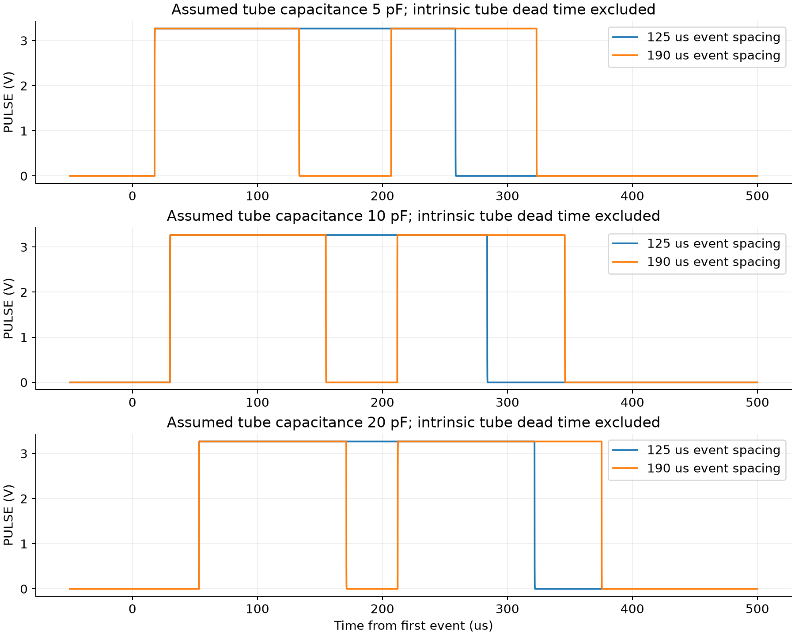

<a id="performance-details-2-maximum-rate-accuracy-limit-versus-saturation"></a>

### 2. Maximum rate: accuracy limit versus saturation

For a nonparalyzable planning model, with true event rate `n`, observed rate `m`
and effective dead time `τ`:

```
m = n / (1 + nτ)
n = m / (1 - mτ)
fraction lost = 1 - m/n = mτ
```

A GM tube may behave differently near overload; it can become insensitive and
produce deceptively low counts. Saturation is not a valid dose measurement.
The tube manufacturer's recommended range and circuit behavior must bound the
usable range. [Philips GM tube handbook, dead time and high-dose behavior](https://frank.pocnet.net/other/Philips/elcoma/Philips_ElectronTubes_6_1983-07.pdf).

Using the provisional gamma sensitivity `K = 2.9 cps/(µSv/h)`:

```
approximate gamma µSv/min = corrected cps / (60 K) = corrected cps / 174
approximate gamma µSv/min = corrected CPM / 10440
```

The factor of **60** converts an hourly dose rate to a per-minute dose rate.
It is not valid for retained beta counts or an unknown gamma spectrum without
calibration. The limits below consider **dead-time loss only**, not calibration,
energy response, statistics, supply sag or missed host GPIO events.

| Effective dead time | Uncorrected loss | Observed cps | True cps in this model | Conditional gamma µSv/min |
|---|---:|---:|---:|---:|
| 190 µs reference | 5% | 263.2 | 277.0 | 1.59 |
| 190 µs reference | 10% | 526.3 | 584.8 | 3.36 |
| **250 µs planning** | **1%** | **40.0** | **40.4** | **0.232** |
| **250 µs planning** | **5%** | **200.0** | **210.5** | **1.21** |
| **250 µs planning** | **10%** | **400.0** | **444.4** | **2.55** |

For this background-monitoring design, **200 observed cps is a provisional
5%-dead-time-loss reporting boundary**. The corresponding gamma-only estimate
is ~1.21 µSv/min of true rate under the stated assumptions. Above that, report
“high rate / accuracy reduced” rather than quietly extending the claimed range.
These are planning thresholds, not alarm or personal-safety thresholds.

The mathematical count ceiling `1/250 µs = 4000 cps` would naively display
**22.99 µSv/min** without correction. **That is not a maximum measurable dose
rate**: at that asymptote, inferred true rate diverges and the inversion is
ill-conditioned. There is no defensible absolute maximum µSv/min specification
for the uncalibrated beta-sensitive prototype yet.

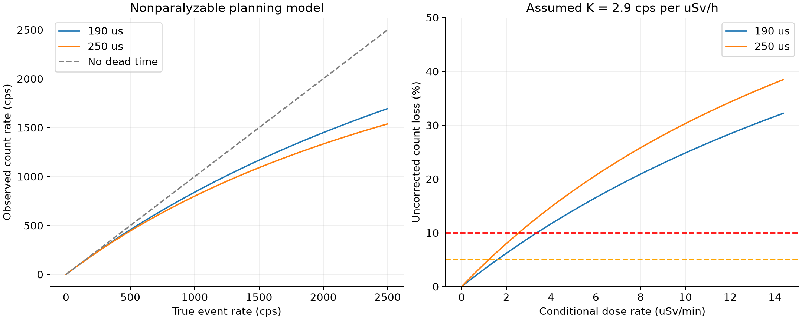

<a id="performance-details-is-the-hv-supply-the-limiting-factor"></a>

#### Is the HV supply the limiting factor?

The synthetic event charge is `20 µA × (100 µs + 1 µs edges) = 2.02 nC`.
At 200 detected events/s this would draw ~0.404 µA; at 400/s, ~0.808 µA.
Those loads are below the separately simulated 5 µA external-load case.
However, actual avalanche charge has not been measured and partially recovered
pulses may draw charge without crossing the discriminator threshold.

Use `Ievents = Qevent × event rate` with measured charge before quoting a supply
limited range. At 5 µA, the 4.98 MΩ anode resistor drops **24.9 V**: measure the
actual tube bias, not only the multiplier rail. The 20 µA low-supply stress case
fails to reach 396 V even at the rail. It is not a validated high-count-rate mode.

<a id="performance-details-3-how-much-current-from-33-v"></a>

### 3. How much current from 3.3 V?

<a id="performance-details-what-the-existing-spice-model-actually-predicts"></a>

#### What the existing SPICE model actually predicts

| Condition at 3.3 V | Modeled supply current |
|---|---:|
| No *additional* HV load; synthetic 50 events/s still present | 2.365 mA |
| 1 µA additional HV load | **2.515 mA** |
| 5 µA additional HV load | 3.123 mA |
| 20 µA additional HV load | 5.323 mA |
| Shorted tube | 6.030 mA |
| Startup, EN rise to first 396 V | **5.774 mA average** |

Native steady figures use 150–190 ms. They include the modeled supply, feedback,
OVP and passive bleeder. They omit the physical oscillator, comparator supply
currents, switching drive and some pulse-logic supply current.

An illustrative **whole-module planning budget** at the 1 µA load point is:

| Contribution | Allowance | Basis |
|---|---:|---|
| Existing SPICE power path | 2.515 mA | Simulated |
| CMOS timer | 0.250 mA | Planning allowance; TI specifies 180 µA typical / 250 µA max at 5 V, 25°C, not a 3.3 V guarantee |
| Two TLV3012B comparators | 0.0062 mA | 2 × 3.1 µA maximum quiescent, reference loading extra |
| Conditioning / blanking logic | 0.100 mA | Allowance; final gate quantities and wiring pending |
| HV BJT base drive | 1.200 mA | 60 mA / forced β10 × 20% duty, assuming pulses every cycle |
| Additional real device losses | 1.000 mA | Engineering margin, not simulated |
| **Illustrative total** | **5.071 mA** | **~16.7 mW at 3.3 V** |

**Plan for roughly 5 mA operating draw, allocate 10 mA continuous and 20 mA for
average startup.** These are design budgets, not guaranteed limits; a physical
controller could change them. At background, controller/drive implementation and
permanent HV loads matter much more than detected-event charge. EN-off current
is not established: holding a CMOS timer in reset is not a complete power cut.

[TI LMC555 supply specifications](https://www.ti.com/lit/ds/symlink/lmc555.pdf)
· [TI TLV3012B specifications](https://www.ti.com/lit/ds/symlink/tlv3012.pdf).

<a id="performance-details-power-on-inrush-is-a-separate-unresolved-requirement"></a>

#### Power-on inrush is a separate unresolved requirement

The present ideal source applies 3.3 V instantly through 0.5 Ω into a discharged
22 µF capacitor. Thus the model produces **6.6 A at t≈0** (`3.3/0.5`) with an
11 µs input RC constant. This is an idealized hot-plug transient, not an expected
Pi capability or a credible physical current waveform. Wiring, ESR and the Pi's
rail impedance/current limiting are missing.

Input charging requires `Q = CΔV = 72.6 µC`. To limit charging alone to 20 mA,
a linear ramp needs at least **3.63 ms**, plus margin for other loads. Add an
appropriately designed soft-start/current-limited input and verify Pi rail droop.
The 10/20 mA budgets above do not bound an uncontrolled hot-plug spike.

<a id="performance-details-4-background-statistics-and-validation"></a>

### 4. Background statistics and validation

At the provisional 2.9 cps per µSv/h sensitivity, a gamma field of 0.1 µSv/h
would contribute 0.29 cps, or 17.4 counts/minute. Poisson uncertainty alone would
be about 24% in a minute, before intrinsic background, calibration and beta counts.
For a constant total observed rate of 0.5 cps, 200 s gives ~100 counts (~10%
relative standard deviation), and 800 s gives ~400 counts (~5%). Background
subtraction increases uncertainty. Longer integration is therefore more useful
than dead-time correction for typical background monitoring.

Before assigning an absolute rate specification:

- Measure tube plateau, intrinsic background, pulse-charge distribution and
  two-source/dead-time behavior at the actual 400 V bias.
- Test electrical paired pulses at the connector, including the real Pi input,
  cable capacitance, logic thresholds and host event capture.
- Characterize the gamma response separately from beta sensitivity; retain raw
  counts and calibration metadata alongside approximate µSv values.
- Recheck leakage, capacitance and beta attenuation after coating or potting.
  Do not pot the NOS tube or clips by default; material and process remain open.
- Address overload/fault reporting: the current four-wire circuit blanks PULSE
  on low HV, so a fault can resemble a quiet radiation field. A status encoding
  or other host-side health check is needed before unattended dependable use.

<a id="performance-details-reproduce"></a>

### Reproduce

`bun run analyze:performance` runs 33 short paired-pulse native SPICE cases and
regenerates [results](docs/performance/results.json) and the two charts. It reuses the
unchanged pulse-stage netlist with a stiff HV test source. Existing full-HV runs
are not rerun. Source-current startup metrics use adaptive data when available;
a clean clone falls back to the versioned 10 µs trace and labels that difference.

<a id="cost-details"></a>

## Expected production cost

**Current revision:** J2/J3 C142864 are DNP at JLC. The anode resistors now
require external sourcing; earlier 25/50-board budgets below are historical
baselines pending that quote. The revised five-board allowance is $150–250.
See [part selections](#part-details).

Historical budget dated 2026-09-15, USD: **$14–19 per assembled electronics board at
25 units, or $12–16 at 50 units**, before the external anode-resistor and board-size updates. This is a planning estimate, not a supplier
quote. It excludes the NOS tube, clips, mating cable, enclosure, coating/potting,
shipping, tax/duty, engineering, calibration and functional-test labor.

The design still contains behavioral controller blocks. A price obtained by
counting only the drawn components would omit essential physical circuitry.

<a id="cost-details-catalog-priced-candidate-parts"></a>

### Catalog-priced candidate parts

Prices use the quantity of each part in the entire batch, before assembly attrition.
The source snapshot includes MPNs, stock, tier quantities and supplier links in
[cost-parts.json](docs/cost-parts.json). Catalog pricing may differ from JLC PCBA checkout.

| Part / function | Per board | Cost/board, 25 boards | Cost/board, 50 boards |
|---|---:|---:|---:|
| TDK 10 nF / 630 V C0G, C342714 | 8 | $2.3232 | $2.3232 |
| BAV21W multiplier diode, C155214 | 8 | $0.3040 | $0.3040 |
| TDK 1 mH inductor, C2041861 | 1 | $0.5224 | $0.4606 |
| TLV3012B comparator + reference, C20345924 | 2 | $4.3680 | $3.8700 |
| LMC555 oscillator, C90760 | 1 | $0.3049 | $0.2455 |
| MMBTA42 HV switch, C94389 | 1 | $0.0404 | $0.0404 |
| MMBT3904 pulse transistor, C81464 | 1 | $0.0168 | $0.0168 |
| SN74LVC1G14 Schmitt gate, C7835 | 1 | $0.0651 | $0.0651 |
| 10 MΩ bleeder, C26119 | 4 | $0.0704 | $0.0704 |
| JST GH locking SMT connector, C161692 | 1 | $0.3927 | $0.3404 |
| **Candidate subtotal** | **28** | **$8.4079** | **$7.7364** |

These are candidate quantities, not an orderable production BOM. In particular,
the two independent reference channels must remain independent if the OVP
architecture is retained. The Schmitt gate alone does not implement blanking.

<a id="cost-details-completion-and-manufacturing-allowances"></a>

### Completion and manufacturing allowances

The following amounts are engineering allowances, not researched part quotes:

| Additional cost per board | 25 boards | 50 boards |
|---|---:|---:|
| Remaining resistors/capacitors, HV-rated anode resistors, clamps, blanking logic, input soft-start and driver support | $1.50–3.50 | $1.50–3.50 |
| Purchased excess/attrition and price variation | $0.50–1.20 | $0.45–1.10 |
| Bare two-layer PCB | $0.80–2.00 | $0.60–1.50 |
| Economic SMT assembly, setup and feeder allowance | $2.10–2.90 | $1.10–1.70 |
| **Calculated assembled electronics estimate** | **$13.31–18.01** | **$11.39–15.54** |
| **Rounded working budget** | **$14–19** | **$12–16** |
| **Batch working budget** | **$350–475** | **$600–800** |

PCB allowance assumes a simple approximately 125 × 35 mm two-layer FR-4 board,
one-sided SMT, ordinary finish and no special fabrication. Dimensions are a
costing assumption, not an approved layout. The 110 mm tube prevents assuming
the promotional 100 × 100 mm board price. Final HV spacing and clips can enlarge it.

Assembly uses approximately 120–180 solder joints and 12–18 distinct extended
part numbers: $8.18 setup + $1.53 stencil + $3.07 per extended type, plus
$0.0016 per SMT joint. That gives about $51–72 per batch at 25 boards and
$56–79 at 50, before any checkout-specific adjustments. The fee is per distinct
extended part number, not per placement; eight identical HV capacitors use one
feeder. These published charges are from [JLC's assembly price schedule](https://jlcpcb.com/help/article/pcb-assembly-price).

Economic assembly eligibility, exact feeder count, attrition minima, tooling
rails, panelization and potential additional handling must be checked on the
final design. Standard assembly may cost more. No promotional discounts are
assumed. The excess allowance is a budget reserve, not JLC's attrition formula.

<a id="cost-details-costs-outside-the-electronics-board"></a>

### Costs outside the electronics board

- **Tube:** user already owns the tubes: **$0 new purchase cost**. They still
  need inspection, dimensional checks and electrical testing.
- **Clips and mating Pi cable:** carry a separate provisional **$2–5 per unit**
  materials reserve until exact clips, cable length and terminations are chosen.
  This is not a vendor quote and excludes fitting/crimping labor.
- **Shipping:** carry **$25–60 per shipment** as a provisional reserve only;
  destination and service are not specified. Taxes and import duties are extra.
- Enclosure, coating/potting, assembly of the tube, HV checks, plateau testing,
  count-response checks and any calibration require separate budgets.

For example, a 50-board electronics order plus the clips/cable reserve and one
shipping reserve would be **$725–1,110**, before tubes, enclosure, labor and tax.
Two separately shipped prototype/production orders incur separate setup and freight.

<a id="cost-details-five-board-prototype-batch--tubes-already-owned"></a>

### Five-board prototype batch — tubes already owned

Use **$150–250 for five assembled electronics boards ($30–50 each)**.
Adding provisional clips/cables and one shipping allowance gives **$185–335**
before tax, enclosure, coating and test/assembly labor. Tube purchase cost is $0.
This assumes Economic one-sided SMT is available for the final design.

| Cost for the entire five-board batch | USD |
|---|---:|
| Catalog-priced candidate parts, exact 5-board tier calculation | $49.34 |
| Remaining physical circuitry and external HV parts allowance (unquoted) | $20–50 |
| Purchased excess, attrition minima and pricing reserve | $10–25 |
| Bare PCB allowance, assumed approximately 125 × 35 mm | $10–25 |
| Setup, stencil, additional extended types and SMT placement allowance | $60–85 |
| Calculated electronics total | $149–235 |
| **Rounded electronics budget** | **$150–250** |
| Clips and mating cables, provisional materials reserve | $10–25 |
| Shipping, provisional reserve | $25–60 |
| **Budget including clips/cables and shipping** | **$185–335** |

The candidate subtotal is $9.8686 per board: capacitors $3.1064, diodes $0.3712,
inductor $0.6445, two comparator/references $4.8562, timer $0.3049, switch $0.0404,
pulse transistor $0.0168, Schmitt gate $0.0651, bleeder $0.0704 and connector
$0.3927. Rates come from the stored catalog snapshot; actual component purchase
quantities can be larger than five boards consume. At this batch size, setup and
feeder charges contribute roughly $10–13 per board, so dividing the 50-board
price by ten would significantly underbudget the prototype order.

J2/J3 are DNP and incur no JLC clip procurement/placement charge. If purchased
separately, ten clips for five boards cost approximately $1.90 at the catalog
one-piece price, before vendor pack minima and freight. The existing $10–25
clips/cable reserve includes this; do not add it twice. External anode resistor
prices are not verified, so the $20–50 line is an allowance, not a quote.

<a id="cost-details-original-open-items-list--superseded-by-current-selections"></a>

#### Original open-items list — superseded by current selections

Exact MPN decisions are now recorded in [exact part selections](#part-details).
The following list records why those selections and physical checks were needed.


| Item | What remains |
|---|---|
| Two 2.49 MΩ anode resistors | Exact stocked MPN/footprint; each needs at least 500 V working rating and suitable pulse rating. |
| Eight 33 MΩ divider resistors; 412 kΩ and 402 kΩ bottom legs | Exact MPNs; working voltage, tolerance, temperature/voltage coefficient and leakage must support regulation and OVP accuracy. |
| Reverse base-emitter clamp and remaining passives | Choose exact protection diode and rated capacitors/resistors, including real input bypass and oscillator timing network. |
| Physical U1 HV controller | Complete LMC555 timing, transistor drive and independent regulation/OVP wiring; confirm actual comparator delay and startup behavior. U1 is currently a behavioral block. |
| Physical U2 pulse conditioning | Complete Schmitt/blanking logic, HV-ready detection, enable behavior and unpowered-host protection. U2 is currently behavioral. |
| Input soft-start/current limiting | Select and implement an actual circuit; the existing input capacitor model does not limit power-on inrush. |
| Candidate multiplier diodes and HV switch | Verify reverse stress, leakage, switching loss, drive and safe operating area with the actual circuit. |
| Candidate inductor and HV capacitors | Verify footprint, inductor saturation/DCR and capacitor electrical stress against the final implementation. |
| Tube clips | Measure the owned tube contacts; select clips, retention, spacing and attachment process. A generic fuse clip is not yet qualified. |
| Pi cable and connector footprint | Set cable length/host termination; confirm mating GH contacts/housing, pin order and SMT retention tabs. |

These can be resolved through engineering and part selection; the user-specific
inputs still needed are tube contact dimensions and preferred cable length/host
termination. After this, PCB HV spacing, routing and manufacturing checks remain.
First prototypes must verify current/inrush, HV regulation and discharge, OVP,
pulse voltage, recovery and the owned tube lot's plateau. Those checks establish
whether the design is ready for the later 25–50-board run.

<a id="cost-details-where-cost-reduction-matters"></a>

### Where cost reduction matters

1. The two reference/comparator ICs cost $3.87–4.37 per board. Investigate a
   lower-cost implementation while preserving two independent references,
   input leakage limits, accuracy, startup behavior and protection. Savings are
   not included until the replacement circuit is qualified.
2. The eight selected capacitors cost $2.32 per board at both batch sizes.
   At 50 boards, buying 500 instead of 400 at the quoted 500-piece tier costs
   $126.80 versus $116.16: more cash despite the lower unit price. Do not buy
   excess merely to claim a cheaper per-capacitor figure.
3. Basic/Preferred substitutes save feeder charges. Eliminating one extended
   type saves about $0.123 per board at 25 or $0.061 at 50. Qualify substitutions;
   HV working voltage and leakage take priority over these small savings.
4. Keep assembly on one side and install tubes after reflow/cleaning. Retain
   the requested locking SMT connector; its material cost is only $0.34–0.39.

The next accurate pricing milestone is a pin-complete BOM plus routed board,
followed by JLC's actual fabrication/assembly quote. This document does not
authorize purchasing or establish that the hardware is ready for manufacture.

<a id="cost-details-placement-size-update"></a>

### Placement-size update

The basic layout now measures **140 × 60 mm**, superseding the 125 × 35 mm
assumption used in the PCB allowances above. The component estimates are
unchanged; the bare-board and shipping allowances require a new supplier quote.
Do not treat the earlier totals as a quote for this larger board or scale the
entire assembly cost by board area. See [placement documentation](#layout-details).

<a id="layout-details"></a>

## Basic PCB placement and render review

**Unrouted placement study, not a fabrication release.** This tscircuit layout
reuses the functional schematic's part identities and nets. U1/U2 remain
behavioral blocks; their physical oscillator, comparators, logic and input
soft-start parts still need a complete pin-level schematic and placement.

<a id="layout-details-mechanical-plan"></a>

### Mechanical plan

| Item | Current placement |
|---|---|
| Board | 140 × 60 × 1.6 mm, two copper layers, 2 mm corner chamfers |
| Assembly | All SMT on top; 44 physical footprints |
| Mounting | Four 3.2 mm nonplated holes at (±64, ±24) mm |
| Tube envelope | Assumed 110 × 12 mm, centered at (0, 18) mm |
| Clip centers | 105 mm apart; actual NOS tube contact fit must be measured |
| Tube reserve | 96 × 16 mm central keepout on both sides |
| Controller reserve | 30 × 26 mm centered at (−22, −11) mm |
| J1 | Vertical locking four-pin JST GH SMT connector |
| J2/J3 | C142864, DNP; two plated holes per clip, 7.6 mm pitch |

Coordinates use the board center as origin. The clip holes use 2.1 mm drills and
3.5 mm pads; verify the manufacturer tails, finished-hole tolerance and tube grip
before fabrication. User installation of clips and the owned tube is required.
Chamfers and mounting positions are provisional mechanical choices.

J1 pad geometry follows the [official KiCad JST GH footprint](https://github.com/KiCad/kicad-footprints/blob/master/Connector_JST.pretty/JST_GH_BM04B-GHS-TBT_1x04-1MP_P1.25mm_Vertical.kicad_mod)
and should be checked against the [JST GH drawing](https://www.jst-mfg.com/product/pdf/eng/eGH.pdf).
Clip ratings and source references are in [part selection](#part-details).

<a id="layout-details-render-gallery"></a>

### Render gallery


The native tscircuit 3D preview uses generic passive/semiconductor packages.
It does not include the tube or accurate JST/clip bodies, so it cannot establish
mechanical interference clearance. Red hatching is the tube keepout.


Vector images: [placement](docs/layout/placement.svg), [top copper](docs/layout/top-copper.svg),
[bottom copper](docs/layout/bottom-copper.svg), [silkscreen](docs/layout/silkscreen.svg),
[drill](docs/layout/drill.svg), [courtyards](docs/layout/courtyards.svg).
PNG versions are embedded in the [main README](#pcb-renders-and-layer-views).
These views filter actual tscircuit PCB artwork; they are not Gerber exports.
Bottom copper contains only plated clip-hole annuli. Drill artwork retains those
annuli for reference. Cyan courtyard boxes bound component assembly space.

<a id="layout-details-verification-and-assembly-data"></a>

### Verification and assembly data

[Automated checks](docs/layout/checks.json) verify 44 part identities against the
schematic, courtyard presence/non-overlap, board bounds, tube/controller reserves,
mounting hardware reserves and DNP clip-hole retention. There are zero traces,
vias and planes. These checks do not verify electrical connections or HV spacing.

[Review coordinates](docs/layout/placement.csv) are for inspection, not production
pick-and-place. [Published circuit JSON](docs/layout/circuit.json) retains the clip
geometry with DNP restored. During geometry generation the DNP flag is temporarily
cleared because this tscircuit version otherwise omits the holes. The
[review BOM](docs/review-bom.csv) excludes both clips from population.

The build retains connector-orientation heuristic warnings, missing schematic
sheet warnings and incomplete pin-attribute warnings, recorded in the check
report. Vertical connector access and actual tube insertion need mechanical
review. No KiCad DRC or complete 3D interference check has been performed.

<a id="layout-details-remaining-work-before-fabrication"></a>

### Remaining work before fabrication

- Complete and verify the physical U1/U2 circuitry, including soft-start and blanking.
- Measure tube contacts and confirm clip grip, spacing, insertion and enclosure fit.
- Route the converter with short switching loops and local bypassing; keep the
  HV ladder and high-impedance sensing away from Pi signals.
- Establish HV creepage/clearance rules for the actual materials and environment;
  inspect pads, holes, board edges and both copper layers. The current keepout
  and default CAD spacing rules do not establish a safe HV insulation rating.
- Add final silkscreen polarity, pin-one and assembly markings, then review
  fabrication outputs and production BOM/placement rotations.
- Re-quote the larger PCB and qualify protection and Pi rail behavior on hardware.

<a id="layout-details-reproduce"></a>

### Reproduce

From the repository root after installing dependencies:

```sh
bun run build
bun run bom:review
bun run build:layout
bun run render:layout
```

The export script checks placement, writes review data, renders six SVG/PNG
views using `rsvg-convert`, and copies the native tscircuit 3D PNG into `docs/layout`.

## Reproduce

Dependencies: Bun, native ngspice, Python 3 with NumPy/Matplotlib; `rsvg-convert`
for PNG rendering. tscircuit and its dependency versions are pinned in `bun.lock`.

```sh
bun install --frozen-lockfile
python3 -m pip install -r requirements-sim.txt
bun run build
bun run check
bun run bom:review                   # review inventory with DNP, not production BOM
bun run render:schematic             # full sheet and readable detail views
bun run build:layout                 # unrouted PCB SVG and native 3D preview
bun run render:layout                # placement checks and published layer images
bun run sim                         # native supply/load/fault sweep and plots
bun run sim:sync                    # regenerate tscircuit SPICE subcircuit
bun run sim:tsci > docs/hv/tsci-run.log 2>&1
bun run sim:plots                   # validate WASM run and compare startup
python3 scripts/update_readme.py    # refresh numerical summary
bun run analyze:performance         # paired pulses, dead-time/rate/power calculations
```

The tscircuit preload only compresses the CLI result table to
`build/tsci/hv-table.txt.gz`; it does not change the solver. Native decks/logs
and large raw outputs live in ignored `build/`. Charts, compact traces, metrics
and the actual WASM run log are versioned. The CLI may warn about ignored
internal-node initial conditions when wrapping a subcircuit; preserve and review
its log. These warnings are not evidence of hardware validation.

## Origin

Adapted from local `geiger2`, revision
`57b206a88d6513fb3bc38d2fa9b1ea6aec39ed02`: tube requirements, multiplier topology,
SPICE model, tscircuit ladder drawing and simulation tooling. Added the four-wire
Pi interface, 3.3 V sweep, transistor pulse stage, enable, OVP and passive bleeder.
The geiger2 source project was left unchanged.

Repository: [muonTelescope/glowcost-geiger](https://github.com/muonTelescope/glowcost-geiger).
Primary references and component review are linked in
[design decisions](#design-details-primary-references).
