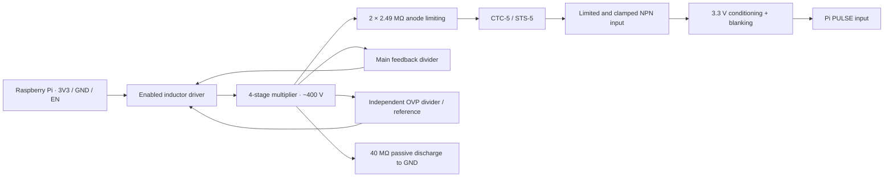

# glowcost-geiger

**A four-wire, Raspberry Pi-controlled Geiger module:** 3.3 V in, ground, a
3.3 V pulse output and power enable. Uses the same **CTC-5 / STS-5 (СТС-5)**
Geiger–Müller tube as geiger2, biased near 400 V.

**Status: functional tscircuit schematic and reproducible SPICE study.** The HV
oscillator/switch, comparator timing and output blanking contain behavioral
models. JLC component candidates are documented; this is not a routed PCB,
complete pin-level production schematic or fabrication release. HV protection
is modeled, not bench-qualified.

## Raspberry Pi interface

| J1 pin | Signal | Direction at module | Connection / behavior |
|---|---|---|---|
| 1 | 3V3 | Power input | Pi **3.3 V power rail**, nominal 3.3 V; simulated ±5% |
| 2 | GND | Return | Common ground with Pi |
| 3 | PULSE | Output | Active-high **3.3 V** logic; count rising edges |
| 4 | EN | Input | Active-high 3.3 V control; 100 kΩ pulldown defaults off |

The initial 5 V requirement was superseded by 3.3 V for Raspberry Pi operation.
PULSE is TTL-compatible in level, but is **not a 5 V output**. Power the module
from the Pi's power rail, not from a GPIO. EN gates HV switching and blanks the
pulse output; low-voltage circuitry may still consume current while disabled.

Example for a Pi with a 40-pin header: physical pin 1 → 3V3, pin 6 → GND,
pin 11 / BCM GPIO17 → EN, pin 13 / BCM GPIO27 ← PULSE. These GPIO assignments
are examples, not fixed by the hardware. Keep EN low during initialization;
allow the HV rail to settle after asserting it. No HV-ready pin is exposed.
Use edge counting; Linux polling can miss short pulses. The simulated pulse
width is stimulus-dependent and is not a measured tube specification.

No MCU, radio, firmware, battery or display. Tube contacts are internal to the
module. The tube will mount on-board with clips. J1 is a locking SMT JST GH candidate
from JLC; 0603 low-voltage passives are accepted. Target batch: 25–50 boards,
indoor use, beta sensitivity retained. Tube clip MPN and cable length remain open.

## Circuit



### Annotated schematic

[Full annotated sheet](docs/schematic.svg) · [tscircuit source](board/module.circuit.tsx)
· [SPICE source](sim/hv/converter.cir) · [JLC candidates and design decisions](docs/design-decisions.md)


[Passive discharge detail](docs/schematic-discharge.svg)

The sheet is organized into six annotated sections: power/enable, multiplier,
main feedback, independent overvoltage cutoff, tube/pulse input and discharge.
Named nets connect the sections without wires crossing the notes. Open the SVG
to zoom into component values and pin labels. The drawing shows all eight
multiplier diodes/capacitors, feedback and protection dividers, bleeder and tube interface. U1/U2 are explicitly labeled behavioral
blocks. Their symbols are not real IC pinouts. The checker compares 45 components
and 30 exposed nets against SPICE, including diode polarity and passive values.

## Tube and HV protection

Inherited geiger2 tube targets: CTC-5 / STS-5, approximately 110 × Ø12 mm,
360–440 V operating range, 5–10 MΩ anode load. These are project requirements
for a NOS tube; confirm the actual tube's plateau and pulse charge on the bench.

- **Independent overvoltage cutoff:** separate divider and reference, nominal
  ~409 V trip, inhibits switching if the main regulation loop fails low.
- **Passive discharge:** four 10 MΩ resistors remain connected with EN off.
- **Fault-current limitation:** two 2.49 MΩ anode resistors; specify each for
  ≥500 V working voltage so one shorted resistor does not overstress the other.
- **Pi input separation:** grounded-emitter NPN with 100 kΩ base resistance,
  reverse base-emitter clamp, local 3.3 V collector pullup and 1 kΩ output series
  resistor. HV is not intentionally connected to the GPIO.
- **Startup/shutdown blanking:** pulses are suppressed when disabled, below
  360 V or in overvoltage. Physical logic implementation remains to be designed.

**EN off does not mean discharged.** The plots show residual HV after shutdown.
The board must enclose exposed HV and maintain HV-to-logic creepage/clearance;
those protections require an actual PCB/enclosure review. This common-ground
architecture is not galvanic isolation. See [fault coverage and unresolved
protection checks](docs/design-decisions.md#hv-protection-and-limits).

## Expected dead time, rate and current

| Quantity | Planning estimate |
|---|---|
| Effective dead time | **~190–250 µs**; use **250 µs** until measured |
| 5% uncorrected dead-time-loss boundary | **200 observed cps**; ~**1.21 µSv/min** conditional gamma estimate |
| 10% uncorrected loss boundary | **400 observed cps**; ~**2.55 µSv/min** conditional gamma estimate |
| Existing 3.3 V power-path simulation | **2.515 mA** at 1 µA added HV load |
| Illustrative whole-module operating budget | **~5.1 mA**; reserve **10 mA continuous** |
| Startup after enable | **5.77 mA modeled average**; reserve **20 mA average**, separate from inrush |

**Counts are primary; µSv is approximate.** The rate conversions assume a
reference gamma response of 2.9 cps per µSv/h, not calibration of this tube.
They are not valid for arbitrary beta/gamma mixtures. The mathematical 4000 cps
ceiling (~23 µSv/min naive display) is **not a usable measurement range**.

The 33 new paired-pulse SPICE cases resolve synthetic pulses at 150–175 µs
spacing, but do not model intrinsic tube dead time. Power-on inrush is still
uncontrolled: the ideal 22 µF / 0.5 Ω input model produces a 6.6 A mathematical
spike, so physical soft-start and Pi rail-droop tests remain necessary.

[Detailed calculations, source references, pulse-pair charts and current budget](docs/performance.md)
· [Machine-readable results](docs/performance/results.json)

## Expected cost

**Five-board prototype batch, tubes already owned:** allow **$130–190** for
assembled electronics, or **$165–275** including provisional clips/cables and
shipping. Taxes, enclosure and test labor are extra. See the
[five-board breakdown and unresolved parts](docs/cost-estimate.md#five-board-prototype-batch--tubes-already-owned).

Budget **$14–19 per assembled electronics board at 25 units** ($350–475 total),
or **$12–16 at 50 units** ($600–800 total), in USD. These estimates include PCB,
SMT assembly and allowances for the unfinished physical circuitry. They exclude
the tube, clips/cable, enclosure, shipping, tax and functional testing.

The catalog-priced candidate parts alone total $8.41 / $7.74 per board; the two
comparator/reference ICs and eight HV capacitors dominate.
[Detailed cost breakdown, sources and assumptions](docs/cost-estimate.md).

## Assembly plan

- **25–50 boards:** optimize JLC SMT assembly cost; use 0603 low-voltage passives
  and larger parts where HV ratings require them.
- **Pi connector:** locking SMT JST GH, BM04B-GHS-TBT(LF)(SN), JLC C161692.
  The mating cable is separate; its length remains to be specified.
- **Tube:** on-board clips; install the NOS tube after reflow and cleaning.
  Clip selection and mechanical retention remain to be finalized.
- **Environment:** dry indoor enclosure initially. Future conformal coating or
  potting requires rechecking HV leakage, pulse recovery and beta response.
  Keep coating out of connector and tube-clip contact surfaces.

[Candidate stock snapshot](docs/assembly-stock.json) and
[assembly decisions](docs/design-decisions.md) record the selections and open checks.

## SPICE results

All charts below are generated from this repository's **3.3 V model**, not copied
from the older battery-powered geiger2 results.


<!-- RESULTS START -->
| Supply / 1 µA added load | Mean HV | HV range | First 396 V after EN | Modeled input |
|---|---:|---:|---:|---:|
| 3.135 V | 399.36 V | 396.81–403.49 V | 33.22 ms | 2.676 mA |
| 3.3 V | 399.28 V | 396.73–403.79 V | 28.72 ms | 2.515 mA |
| 3.465 V | 399.24 V | 396.50–404.23 V | 25.32 ms | 2.403 mA |

Native: 16 cases. Open-feedback peak: **412.67 V**;
worst-direction 1% OVP reference/divider corner peak: **425.29 V**.
Nominal HV remains **158.1 V at 300 ms**, about 100 ms after EN falls.
WASM: 682,075 points over 120 ms; mean HV **399.29 V**.
<!-- RESULTS END -->

[Native metrics JSON](docs/hv/results.json) · [CSV](docs/hv/results.csv)
· [tscircuit/WASM metrics](docs/hv/tsci-results.json)


### Assumptions and practical limits

- 1 mH linear inductor, 9.5 Ω DCR; 10 kHz, 20 µs switch pulses. Ideal 2 Ω
  controlled switch with 30 pF output capacitance. Actual transistor base/gate
  drive, saturation, core loss and controller current are not modeled.
- Eight 10 nF capacitors, generic fast diodes. The generic diode's 250 V model
  breakdown is **not** the candidate BAV21W's 200 V DC rating. Per-device reverse
  stress, leakage and temperature must be checked before locking that part.
- Main divider: 4×33 MΩ + 412 kΩ, 1.242 V reference → 399.16 V nominal.
  OVP: independent 4×33 MΩ + 402 kΩ → 409.06 V nominal. OVP is behavioral;
  real delay, power sequencing and shared-cause failures remain unverified.
- At 400 V: main divider ~3.02 µA, OVP divider ~3.02 µA, bleeder 10 µA.
  Protection adds real input-power demand; do not quote the old battery results.
- Synthetic tube event: 20 µA for 100 µs every 20 ms, starting at 100 ms,
  scaled down with HV; 5 pF tube capacitance is assumed. This is neither a
  physical avalanche model nor a calibration/count-rate/dead-time prediction.
- Reported input current includes the modeled converter and passive loads,
  but excludes real oscillator/comparator/logic/driver current. It is not a
  complete module current budget or a measured efficiency claim.
- Native ngspice uses Gear integration. WASM uses the tscircuit engine defaults.
  Native EN rises at 5 ms; WASM EN is high at t=0. The comparison aligns this
  5 ms difference. Numerical switching ripple is not hardware verification.
- The WASM model reports a **3.50 V numerical pulse-transition peak** at a
  nominal 3.3 V supply; native reports ~3.30 V. Resolve time-step/driver-model
  convergence and verify GPIO transients on hardware before connecting a Pi.
  A behavioral simulation is not proof of a protected physical output.
- Native metrics use adaptive samples over 150–190 ms; plotted traces are
  linearized at 10 µs and can miss narrow peaks. WASM metrics use 80–120 ms.
  Startup is first crossing of 396 V, not a guaranteed settling time. The
  3.135 V / 20 µA stress case does not reach 396 V in the enabled interval;
  the study does not establish 20 µA load capability at the low supply corner.

## Reproduce

Dependencies: Bun, native ngspice, Python 3 with NumPy/Matplotlib; `rsvg-convert`
for PNG rendering. tscircuit and its dependency versions are pinned in `bun.lock`.

```sh
bun install --frozen-lockfile
python3 -m pip install -r requirements-sim.txt
bun run build
bun run check
bun run render:schematic             # full sheet and readable detail views
bun run sim                         # native supply/load/fault sweep and plots
bun run sim:sync                    # regenerate tscircuit SPICE subcircuit
bun run sim:tsci > docs/hv/tsci-run.log 2>&1
bun run sim:plots                   # validate WASM run and compare startup
python3 scripts/update_readme.py    # refresh numerical summary
bun run analyze:performance         # paired pulses, dead-time/rate/power calculations
```

The tscircuit preload only compresses the CLI result table to
`build/tsci/hv-table.txt.gz`; it does not change the solver. Native decks/logs
and large raw outputs live in ignored `build/`. Charts, compact traces, metrics
and the actual WASM run log are versioned. The CLI may warn about ignored
internal-node initial conditions when wrapping a subcircuit; preserve and review
its log. These warnings are not evidence of hardware validation.

## Origin

Adapted from local `geiger2`, revision
`57b206a88d6513fb3bc38d2fa9b1ea6aec39ed02`: tube requirements, multiplier topology,
SPICE model, tscircuit ladder drawing and simulation tooling. Added the four-wire
Pi interface, 3.3 V sweep, transistor pulse stage, enable, OVP and passive bleeder.
The geiger2 source project was left unchanged.

Repository: [muonTelescope/glowcost-geiger](https://github.com/muonTelescope/glowcost-geiger).
Primary references and component review are linked in
[design decisions](docs/design-decisions.md#primary-references).
