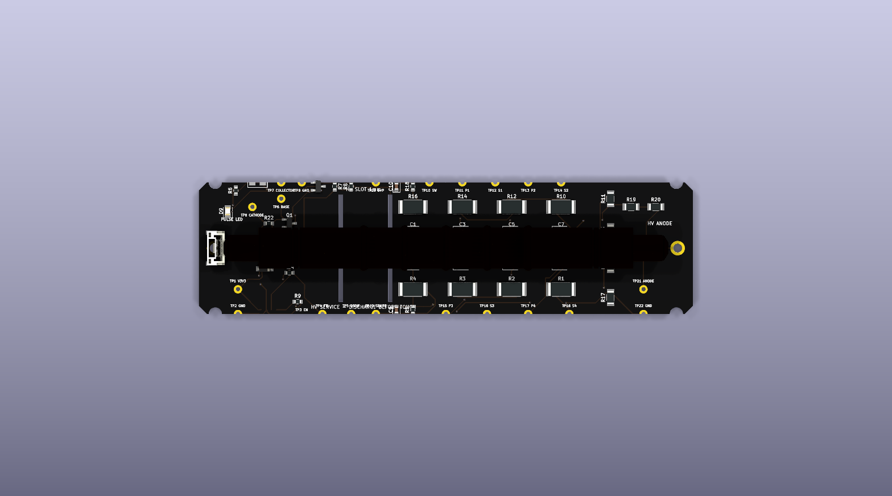
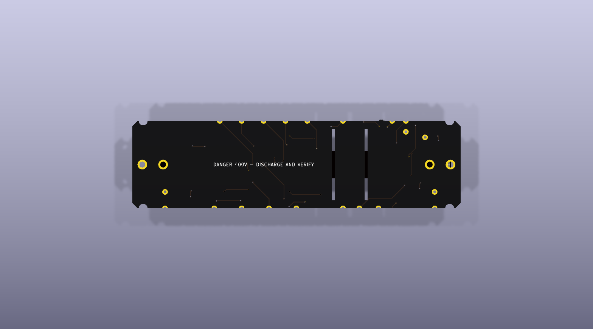
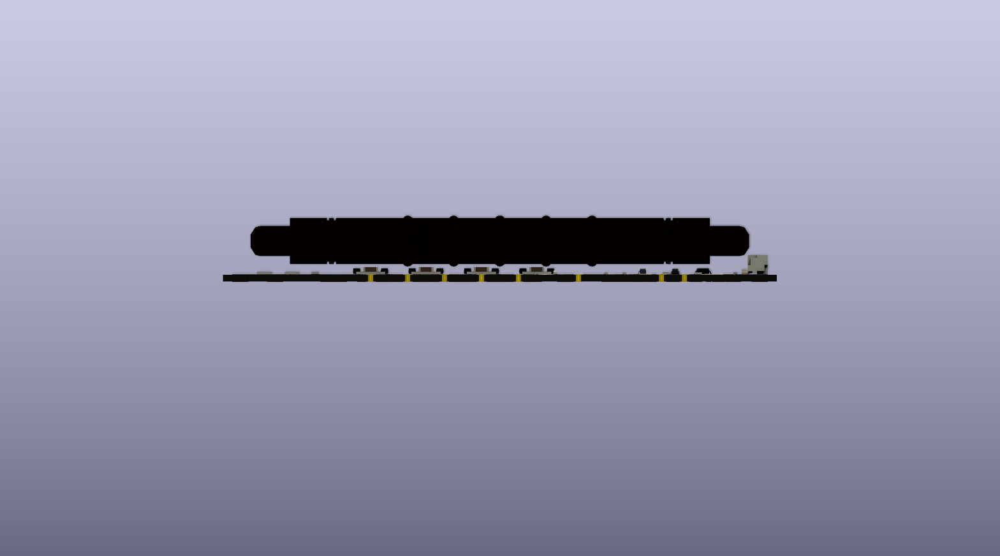
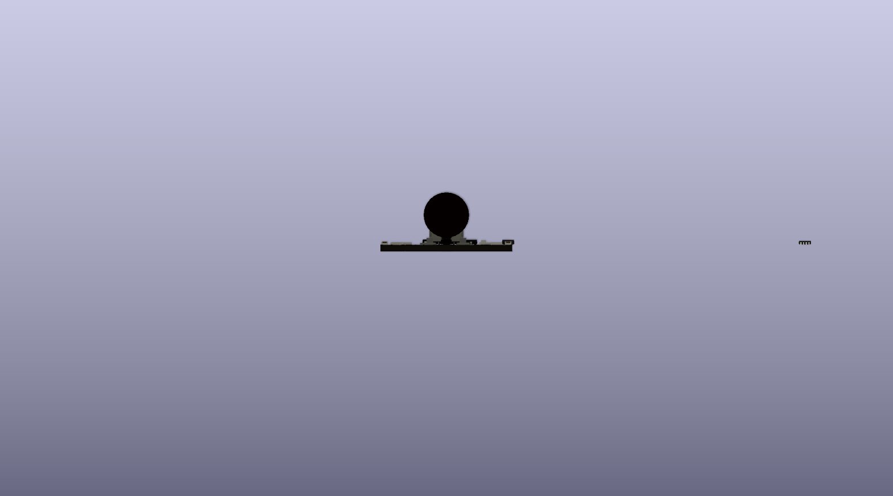
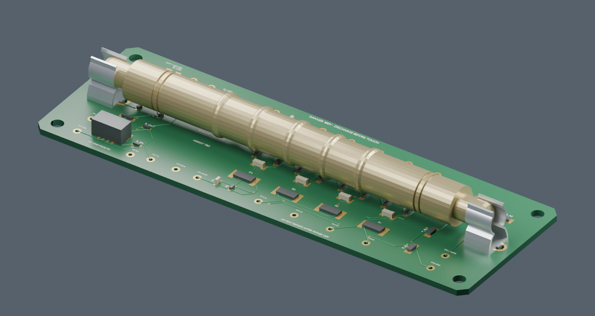
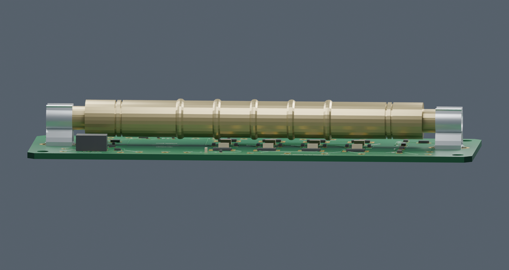

# Glowcost Geiger

**Simple description:** this is a compact four-wire Geiger module for a Raspberry
Pi. It powers a CTC-5 / STS-5 tube from 3.3 V, generates the tube's high voltage,
and exposes raw TTL pulses plus a future STEMMA QT I²C telemetry interface.
The ATtiny1616 is intended to count pulses and report diagnostics without
changing the hardware pulse path.

> **Prototype:** the KiCad routing has known DRC clearance errors. The HV design
> is not bench-qualified or approved for fabrication. Use suitable HV procedures.

## Design summary

- Hardware HV oscillator, switch, multiplier, protection, and comparator.
- TTL pulse output plus green 0805 pulse LED with cuttable enable bridge.
- Horizontal CTC-5 / STS-5 tube under two DNP C142864 clips.
- Two STEMMA QT / SparkFun Qwiic connectors in parallel for I²C daisy chaining.
- ATtiny1616 option for pulse counting, HV/3.3 V readback, fault flags, and I²C slave registers.
- Two solder-selectable address pads on leftover MCU GPIOs.
- 120 x 32 x 1.6 mm, two-layer compact PCB.
- Two 1.0 mm routed Edge.Cuts isolation slots split the HV service region.

## STEMMA QT and address selection

STEMMA QT and Qwiic use the same JST-SH 4-pin bus: GND, 3.3 V, SDA, and SCL.
The two connectors are parallel pass-through ports. Enable only one pull-up set on
each bus segment.

Address links are two-pad bridges. Open is logic-high through the ATtiny1616
internal pull-up; bridged is logic-low:

| A1 | A0 | Address |
|---:|---:|---:|
| open | open | `0x2F` |
| open | bridged | `0x30` |
| bridged | open | `0x31` |
| bridged | bridged | `0x32` |

The default `0x2F` is intentionally outside the common addresses called out by
Adafruit; firmware may later store another address. The ATtiny1616 uses UPDI
programming pads (VCC, DATA, GND), not legacy six-wire AVR ISP. UART is exposed
as through-hole debug pads only. All programming and address pads stay on the
low-voltage side.

## Mechanical design

The supplied Littelfuse 102071 drawing and local datasheet agree on the
dimensioned values: 7.6 mm tail pitch, 7.9 mm base width, 10.9 mm height,
R3.2 spring radius, 7.2 mm radius-centre height, 3.6 mm tail extension, and
2.0 +/- 0.1 mm holes. C142864 is DNP at JLC and fitted after assembly.

- [Clip datasheet](kicad/models/C142864-datasheet.pdf)
- [Clip STEP](kicad/models/C142864.step)
- [Clip STL](cad/models/C142864/C142864.stl)
- [FreeCAD source](cad/models/C142864/C142864.FCStd)
- [Annotated comparison](docs/kicad/C142864-annotated-comparison.png)

The STEP is a formed-sheet reconstruction. Bend transitions, stamping,
spring deflection, and tail-hole stamping remain approximate.

## KiCad files

- [Schematic](kicad/glowcost-geiger.kicad_sch)
- [PCB](kicad/glowcost-geiger.kicad_pcb)
- [Project](kicad/glowcost-geiger.kicad_pro)
- [Footprints](kicad/glowcost.pretty)
- [Parts selection](kicad/parts-selection.md) · [net classes](kicad/net-classes.md)
- [ATtiny1616 / STEMMA QT revision specification](kicad/mcu-revision.md)
- [Firmware bring-up and diagnostic tools](firmware/README.md)

The study retains the routed HV prototype and 72 placements. Reroute the known
clearance violations before ordering. The internal slots are fabrication slots,
not copper clearances; confirm JLC's minimum routed-slot width and keep them
clear of clips, traces, and enclosure hardware.

## Render gallery

### Board views








### Assembly and clip





Additional views: [board-top](docs/layout/board-top.png),
[placement](docs/layout/placement.png), [top copper](docs/layout/top-copper.png),
[bottom copper](docs/layout/bottom-copper.png), [courtyards](docs/layout/courtyards.png),
[schematic PNG](docs/kicad/schematic.png), and [schematic PDF](docs/kicad/schematic.pdf).

Renders are for review, not Gerber approval. Generic component bodies are
illustrative; tube seating and HV clearance remain unverified.

Assembly silkscreen now calls out the HV slots, discharge warning, raw pulse,
test points, and tube/clip service area. Install the tube and DNP clips only
after reflow and cleaning; keep conformal coating away from clip contacts,
STEMMA QT contacts, and UPDI/UART pads.

## Electrical and sourcing notes

The tube is biased near 400 V. The protected HV divider scales the sense node to
0–3.3 V for the MCU ADC; never connect an MCU pin directly to the tube supply.
Keep HV service nets away from STEMMA QT and Pi wiring.

ATtiny1616-MNR (LCSC C507118) is the preferred MCU: QFN-20, 3 x 3 mm, 16 KB
Flash, 2 KB SRAM, 10-bit ADC, I²C/TWI, timers, Event System, and UPDI. Current
LCSC pricing is typically about $0.90–1.10. See [cost-parts.json](docs/cost-parts.json)
and [review-bom.csv](docs/review-bom.csv) for the cost study.

## SPICE and measured-design findings

The simulations are behavioral planning models, not a substitute for a loaded
tube test. Regenerated outputs are kept here:

| Plot | What it shows |
|---|---|
|  | HV rise and startup time |
|  | HV regulation across modeled loads |
|  | Divider and clamp behavior |
|  | Comparator/TTL pulse shape |
|  | Synthetic pulse-pair response |
|  | Dead-time and rate-loss limits |

Current planning values are approximately 399 V mean HV, 7 V peak-to-peak
ripple, 37–39 ms startup, 190 µs reference dead time, and about 2.5 mA
converter input current in the nominal model. These values still require bench
validation with the actual tube and transformer.

The rate model reaches 1% loss near 40–53 cps depending on the selected dead
time, and the nominal 400 V / 10% loss point is about 2.55 µSv/min using the
uncalibrated 2.9 cps per µSv/h conversion. Counts remain the primary output;
the dose estimate is approximate.

## Findings to resolve before fabrication

- The KiCad prototype still has known DRC clearance violations.
- The ATtiny1616, two STEMMA QT connectors, address bridges, and UART/UPDI pads
  are specified but not yet integrated into the native schematic/PCB release.
- The 1 mm HV slots are present as Edge.Cuts and must be checked against JLC's
  routed-slot capability and the final Gerbers.
- The C142864 STEP is a reconstructed formed-sheet model; stamped tail holes and
  spring deflection are not production-qualified.
- HV creepage, tube seating, conformal-coating boundaries, and loaded current
  remain open hardware checks.

The deterministic review report is [jev-review.json](docs/kicad/jev-review.json).
Jev may rank legal routing candidates, but it does not replace KiCad DRC,
clearance calculations, or human HV review.

## Reproduce outputs

```sh
npm run build:kicad
PYTHONPATH=/Applications/FreeCAD.app/Contents/Resources/lib \
  /Applications/FreeCAD.app/Contents/Resources/bin/python scripts/generate_clip_model.py
blender --background --python scripts/render_clip_model.py
blender --background --python scripts/render_assembly.py
kicad-cli pcb render -o docs/renders/board/top.png \
  kicad/glowcost-geiger.kicad_pcb --side top --quality high
```

Before fabrication: integrate and lock the ATtiny schematic/layout, define the
I²C register map, verify address links, reroute DRC errors, confirm HV creepage,
and test the loaded tube assembly.

## Optional Jev semantic review

KiCad DRC, geometry checks, and clearance calculations remain deterministic.
Jev is optional for higher-level review such as ranking decoupler placement,
flagging a switcher near sensitive analog, or prioritizing silkscreen and
assembly risks. It should receive structured board facts, never replace DRC,
and never receive API keys or private files in the repository.

To enable a local TypeSafe integration, install the TypeSafe SDK in your own
environment and provide the key only through an environment variable:

```sh
export TYPESAFE_API_KEY='paste-a-new-key-here'
```

Do not commit the key, put it in this README, or paste it into issue reports.
The repository currently documents the semantic-review approach but does not
call Jev during the KiCad build. Run the review explicitly with:

```sh
source .venv/bin/activate
python scripts/jev_pcb_review.py
```

It writes `docs/kicad/jev-review.json`. With `TYPESAFE_API_KEY` set, Jev ranks
the legal trace-width candidates; without a key, the deterministic rule gate
still produces a useful report. Jev never edits the PCB and cannot override
KiCad DRC, minimum widths, HV creepage, or the 1 mm isolation slots.
