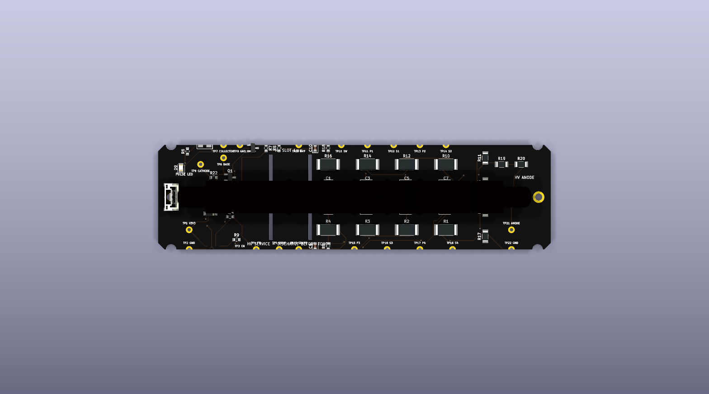
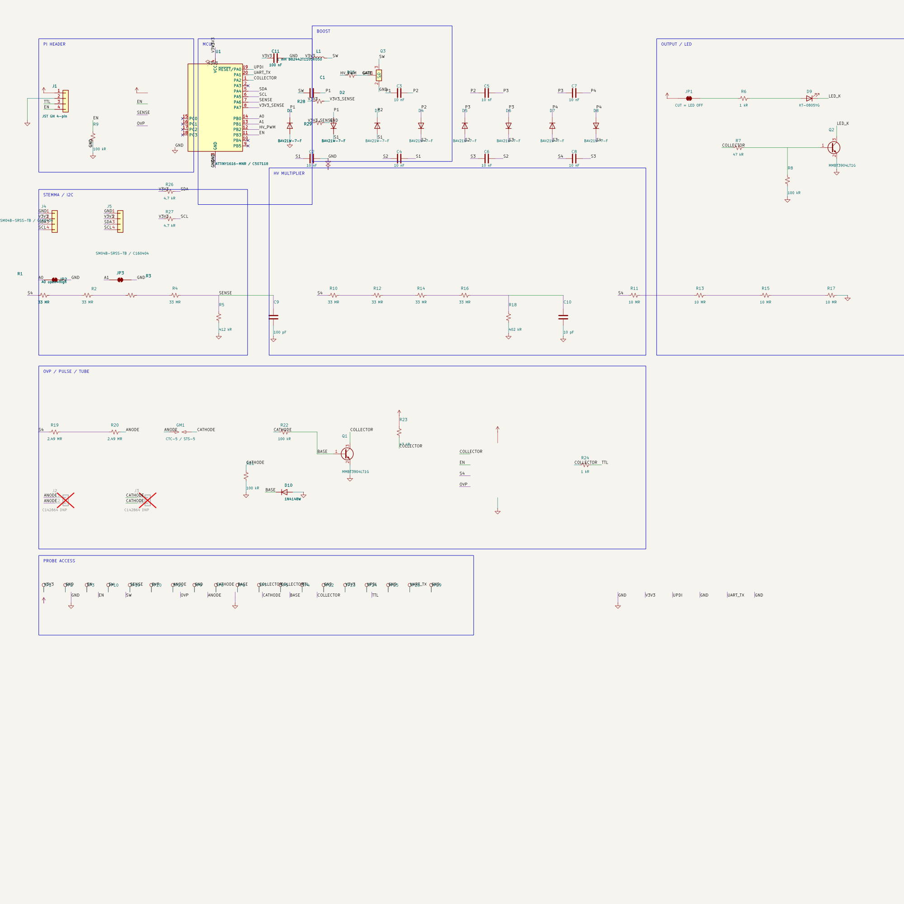
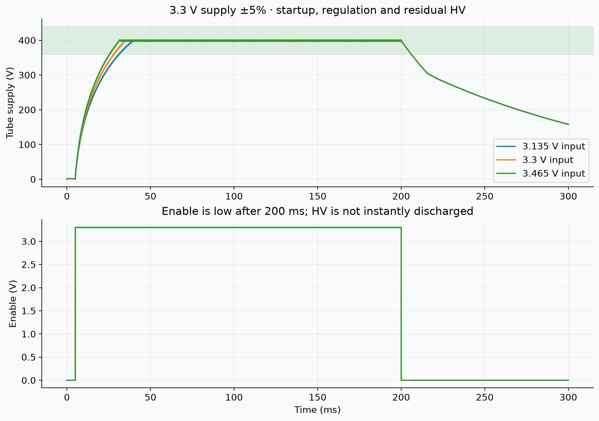
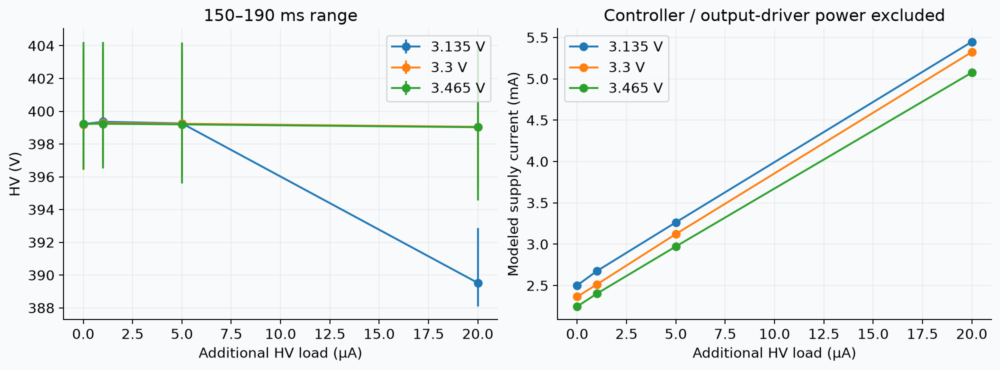
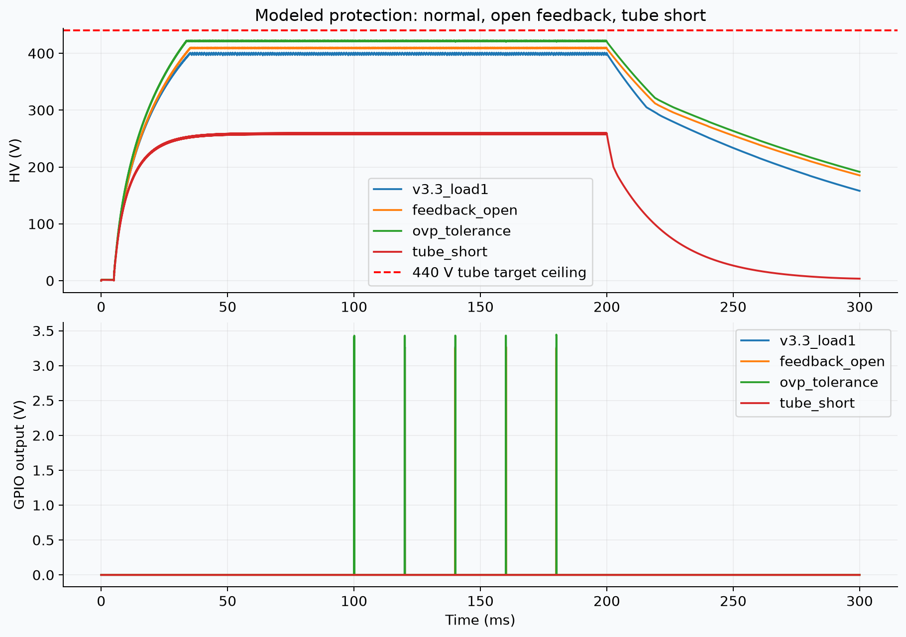

# gLowCost-geiger

Compact four-wire Geiger module for a Raspberry Pi. It powers a CTC-5 / STS-5
tube from 3.3 V, generates the tube high voltage, exposes raw TTL pulses, and
uses an ATtiny1616 for pulse counting, STEMMA QT / Qwiic I²C telemetry, address
straps, and HV/3V3 readback.

> **Prototype.** The PCB still has known DRC clearance issues. The HV design is
> not bench-qualified. Use appropriate high-voltage procedures.

## Design files

Open [`pcb/glowcost-geiger.kicad_pro`](pcb/glowcost-geiger.kicad_pro) in KiCad.
The schematic and PCB are authoritative.

| Path | Contents |
| --- | --- |
| [`pcb/`](pcb/) | KiCad project, symbols, footprints, 3D models |
| [`firmware/`](firmware/) | ATtiny1616 bring-up (`main.c`, `pins.h`) |
| [`cad/models/`](cad/models/) | Tube / clip mechanical sources |
| [`sim/hv/`](sim/hv/) | ngspice HV deck (`converter.cir`) |
| [`docs/sim/`](docs/sim/) | Latest SPICE metrics and plots |
| [`manufacturing/`](manufacturing/) | Fab notes (Gerbers → GitHub Releases) |
| [`docs/images/`](docs/images/) | README figures |

## Board and schematic






## Design summary

- Hardware HV boost, Cockcroft–Walton multiplier, protection, and pulse path
- ATtiny1616-MNR drives `HV_PWM`, counts pulses, serves I2C, reads A0/A1 straps
- Dual STEMMA QT (JST-SH): pin 1 GND, 2 3V3, 3 SDA, 4 SCL
- Horizontal CTC-5 / STS-5 under two DNP Littelfuse C142864 clips
- Target outline about 120 × 32 × 1.6 mm, two-layer, with HV isolation slots

### STEMMA address straps

| A1 | A0 | Address |
| --- | --- | --- |
| open | open | `0x2F` |
| open | bridged | `0x30` |
| bridged | open | `0x31` |
| bridged | bridged | `0x32` |

### MCU pin map

| Net | Pin |
| --- | --- |
| Pulse / collector | PA2 |
| SDA / SCL | PA4 / PA5 |
| HV sense ADC | PA6 |
| 3V3 sense ADC | PA7 |
| A0 / A1 | PB0 / PB1 |
| HV_PWM | PB2 |
| Enable | PB3 |
| UPDI | PA0 |
| UART TX | PA1 |

## Electrical review (2026-09-19)

### Fixed on the schematic

- **Tube anode** — `R20` pad 2 had been left floating after layout cleanup; reattached to `ANODE` (J2 clips).
- **Tube cathode** — `R21` / `R22` were not on `CATHODE`; reattached so J3 → R21→GND and R22→BASE→Q1.

### Still open / firmware-owned

| Issue | Notes |
| --- | --- |
| `/OVP` orphan (TP20 only) | Hardware OVP comparator went away with MCP6562. Board regulation is `SENSE`→PA6; firmware must stop PWM on over-voltage. SPICE still models a behavioral OVP clamp. |
| TTL blanking | PCB TTL is `COLLECTOR` through R24. SPICE blanking (EN / HV-in-range / OVP) is **not** on copper — host/firmware must gate counts. |
| L1 DCR ~9.5 Ω | B82442T1105K050 — efficiency / heating risk at high duty. |
| GM1 SparkGap | `on_board=no` annotation only; real tube is J2/J3. |

See also [`docs/sim/NOTES.md`](docs/sim/NOTES.md).

## HV simulation

Exploratory ngspice model in [`sim/hv/converter.cir`](sim/hv/converter.cir)
(ATtiny-PWM era behavioral gate: clock × soft-start × EN × OVP). Controller and
gate-drive supply current are **not** included.

```bash
python3 scripts/simulate.py
python3 scripts/sync_spice_model.py   # refresh sim/hv/model.ts
```

### Nominal (3.3 V, +1 µA HV load)

| Metric | Value |
| --- | --- |
| HV mean (150–190 ms) | 399.3 V |
| HV range | 397–404 V |
| Startup to ~396 V | 34 ms |
| Peak switch node | 106 V |
| Peak inductor | 59 mA |
| Modeled input current | 2.51 mA |

### Fault / corner checks (PASS)

| Case | Peak HV | Note |
| --- | --- | --- |
| feedback_open | 413 V | Behavioral OVP holds &lt; 440 V |
| ovp_tolerance | 425 V | Worst-direction divider corner |
| disabled | 1.7 V | No HV when EN stuck low |
| tube_short | current-limited | Front-end survives 1 kΩ anode–cathode |

### Diagrams








Full CSV/JSON: [`docs/sim/results.csv`](docs/sim/results.csv),
[`docs/sim/results.json`](docs/sim/results.json).

## Mechanical

Clip CAD (Littelfuse 102071 / LCSC C142864):

- [`pcb/models/C142864.step`](pcb/models/C142864.step)
- [`cad/models/C142864/`](cad/models/C142864/)

Tube body for KiCad 3D: [`pcb/models/tube.step`](pcb/models/tube.step)
(~108 × 11 × 11 mm). Sources: [`cad/models/tube.blend`](cad/models/tube.blend),
[`cad/models/tube.stl`](cad/models/tube.stl). Re-export with FreeCADCmd +
`scripts/export_tube_step.py`.

## Firmware

Build with the Makefile in [`firmware/`](firmware/). Pins are in
`firmware/pins.h`.

## Fabrication

Treat this as a study board until DRC and HV clearance are clean. Order notes
belong under [`manufacturing/`](manufacturing/); release Gerbers via GitHub
Releases rather than committing them here.
