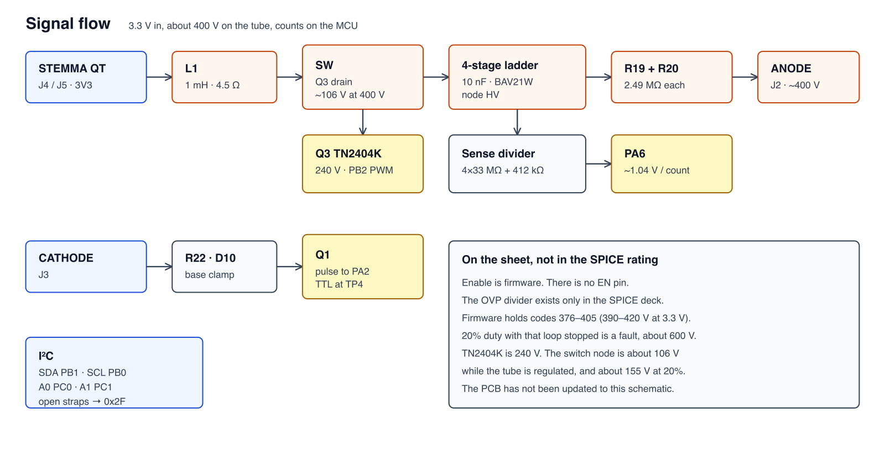
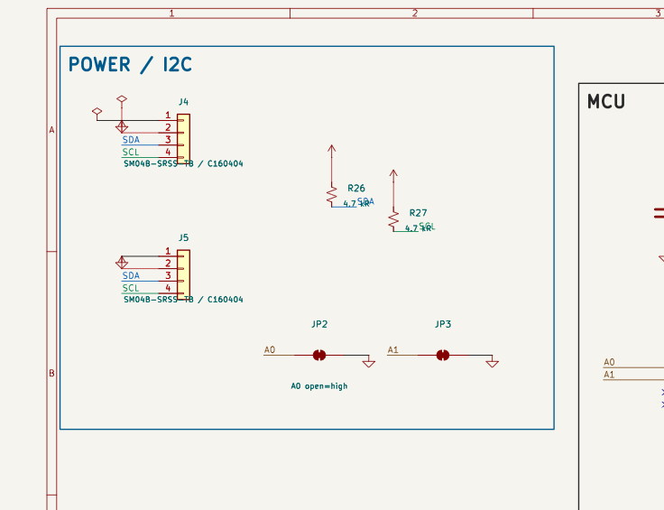
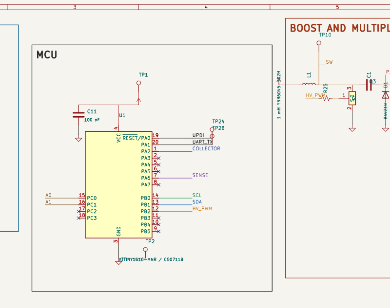
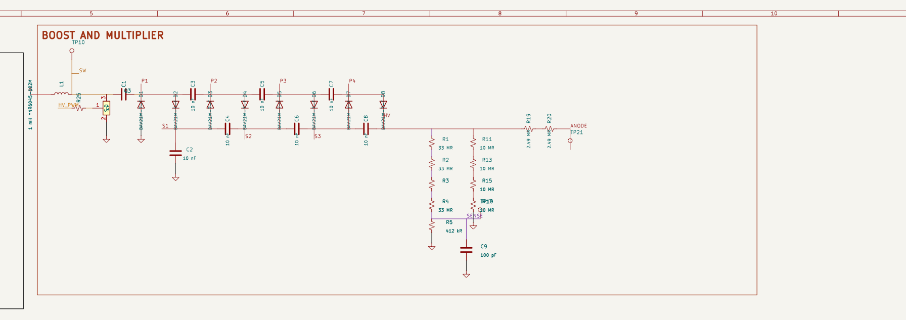
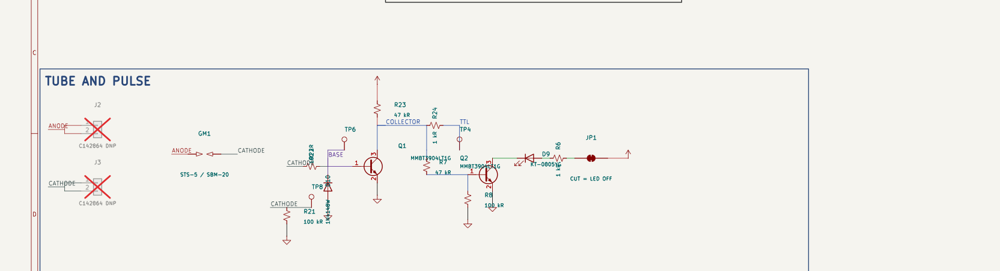
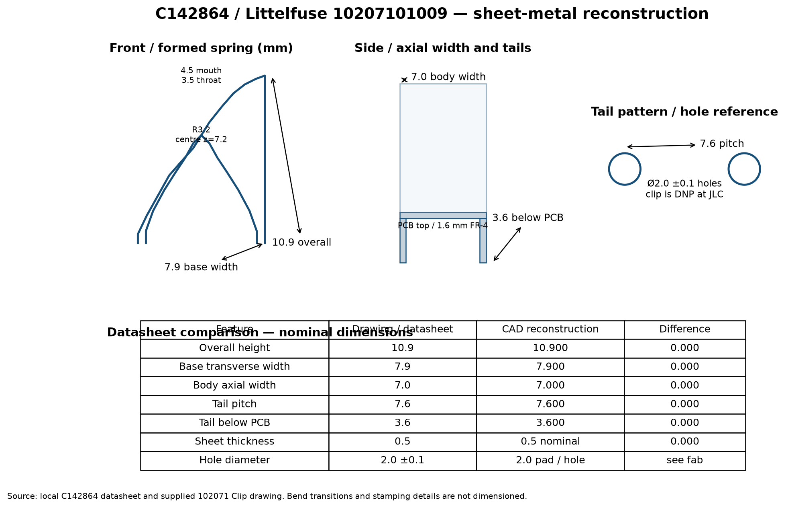
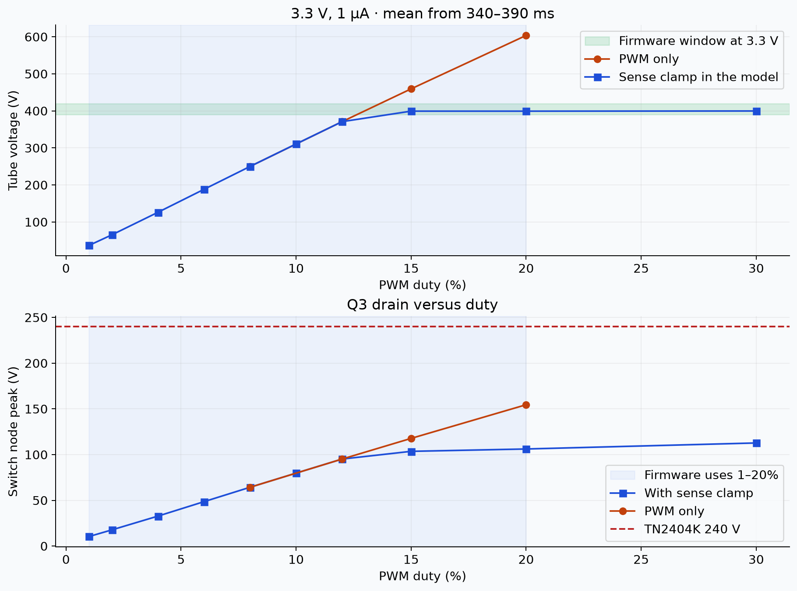
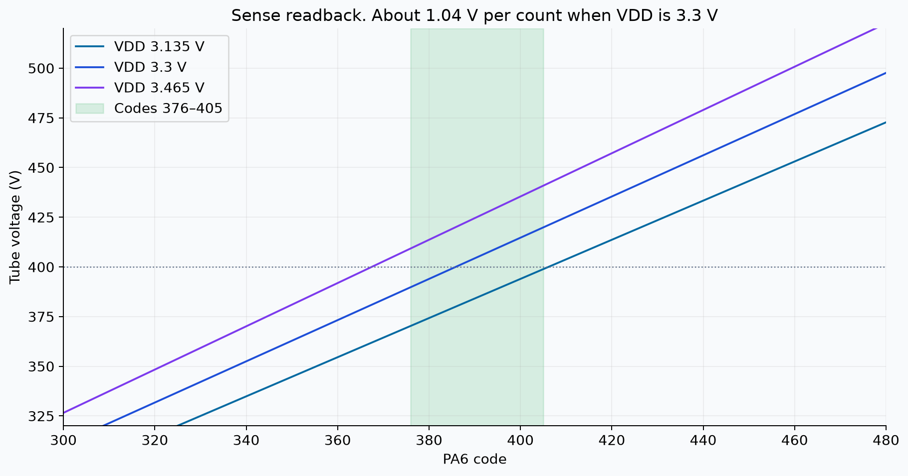

# gLowCost-geiger

A 3.3 V Geiger module for a CTC-5 / STS-5 tube. An ATtiny1616 PWM-drives a boost into a 4-stage Cockcroft–Walton ladder, counts pulses, and reads the tube voltage on PA6. Power and I²C come in on STEMMA QT. TTL is a test point. Enable is firmware.

> Prototype. The PCB is still the previous layout, and the high-voltage design is not bench-qualified.



## Schematic










STEMMA QT pins are 1 GND, 2 3V3, 3 SDA, 4 SCL. Open address straps read `0x2F`; bridging A0, A1, or both selects `0x30`, `0x31`, or `0x32`.

| Net | Pin |
| --- | --- |
| Collector / count | PA2 |
| HV sense | PA6 |
| SDA / SCL | PB1 / PB0 |
| A0 / A1 | PC0 / PC1 |
| HV PWM | PB2 |
| UART TX | PA1 |
| UPDI | PA0 |
| TTL | TP4, from the collector through R24 |

PA3, PA4, PA5, PA7, PB3, PB4, PB5, PC2, and PC3 are no-connect. PA4 and PA5 are not I²C on this part.

Q3 is a TN2404K-T1-GE3 (240 V, SOT-23, 1 gate, 2 source, 3 drain). L1 is a YNR6045-102M, 1 mH, 4.5 Ω. The ladder is 10 nF C0G 630 V and BAV21W, pin 1 cathode. Clips are DNP. J4 and J5 are SM04B-SRSS-TB (C160404) on the stock 1.00 mm JST SH footprint. C11, across VDD, is 100 nF, 50 V, X7R, 0603 (CL10B104KB8NNNC, C1591).



## High voltage

ngspice, 3.3 V, 1 µA, re-run 2026-09-21. The deck’s sense clamp is the firmware loop, not a comparator on the board. Numbers: [`docs/sim/results.csv`](docs/sim/results.csv), [`docs/sim/duty-sweep.csv`](docs/sim/duty-sweep.csv).

| At 3.3 V, 1 µA | |
| --- | --- |
| Tube voltage, 150–190 ms | 399 V (396–404 V) |
| Time to ~396 V | 30 ms |
| Switch peak | 106 V |
| Inductor peak | 62 mA |
| Input current | 2.35 mA |




From 2% to 12% the plant rises about 30.5 V per percent of duty, about 1.5 V per timer count. The model holds 399 V once the sense node reaches 1.242 V. With that clamp removed, 20% duty runs to 604 V and the switch node to 155 V. TN2404K is 240 V, so that fault is inside the drain rating. Firmware uses 1–20% (CMP2 20–400 at 10 kHz) and stops inside codes 376–405.



| | Code | 3.135 V | 3.3 V | 3.465 V |
| --- | --- | --- | --- | --- |
| Recover | 376 | 370 V | 390 V | 409 V |
| 400 V | 386 | 380 V | 400 V | 420 V |
| Trip | 405 | 399 V | 420 V | 441 V |

The ADC reference is VDD, so those codes move about ±5% with the rail.


| Case | Peak tube voltage |
| --- | --- |
| Sense path open | 413 V |
| Divider tolerance corner | 426 V |
| Enable held off | 1.7 V |
| 1 kΩ across the tube | 277 V, TTL stays low |

```bash
python3 scripts/simulate.py
python3 scripts/duty_sweep.py
```

## Firmware

`firmware/main.c` soft-starts PWM on boot and clamps PA6. Trip is code 405 (~420 V at 3.3 V), recover is 376 (~390 V). This bring-up prints the strapped address and does not yet serve I²C. Build with `make -C firmware` (`avr-gcc`, UPDI).

## Still open

- The PCB copper is the previous board. J4, J5, and C11 are not placed. The connector on the board is still J1, the old GH header. `glowcost:J1` in the footprint library is the SRSS land, so updating footprints from the library would change that header’s copper.
- Creepage is not fab-qualified. Discharge the multiplier before handling.
- C142864 clip seating comes from a reconstructed model. Clearance under the tube is not checked.
